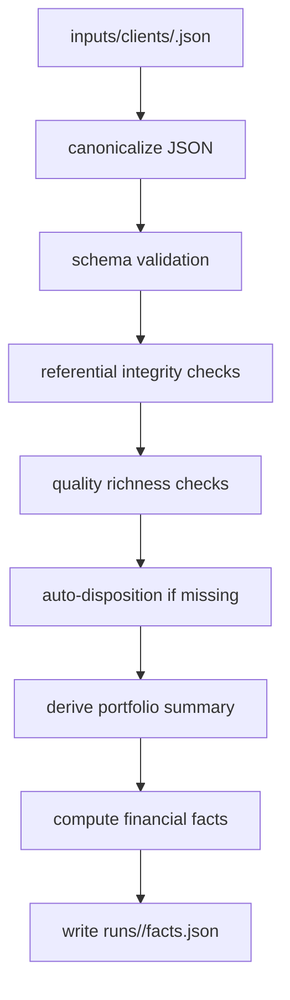

# Ingress Design for Cisco-Quality ADM Automation

## Executive summary

The first and most important deliverable in this assignment is not the renderer and not the 12 model calls. It is the **single structured client ingress**. The assessment makes that explicit: the client input model is the **single source of truth**, it must contain company profile, annual ADM spend, app inventory, competitors with capability gaps, preferred delivery-center locations, and transformation targets, and it is the basis for the code-computed financial layer and every downstream ADM section. The same assessment also requires that code—not the model—compute 5-year contract value, cumulative business value, ROI, offshore workforce savings, investment phasing, and legacy cost reduction, and that the final output be a self-contained HTML ADM with the same major components as the benchmark sample. fileciteturn1file0

The uploaded Cisco sample is therefore a **visual and structural output benchmark**, not an ingress example. In the file as provided, it is a polished single HTML document with a dark sticky sidebar, prominent KPI-led cover treatment, large chart/card layout, and visible top-level destinations such as Executive Summary, Portfolio Analysis, App Inventory, Benchmarking, AI Transformation, Modernization Factory, Cloud & Data Strategy, Financials & Value, and Roadmap. That strongly suggests that some logical sections can be visually consolidated even if the brief still expects 12 logical sections. fileciteturn1file1

Public portfolio-planning guidance from entity["organization","Amazon Web Services","cloud provider"], entity["organization","Google Cloud","cloud platform"], and entity["company","Microsoft","software company"] points in the same direction: a high-quality modernization plan starts with a business-aligned inventory, app criticality, dependencies, environments, compliance context, cost baselines, and wave-planning signals; then it uses that input to drive prioritization, migration strategy, data architecture, and business case creation. AWS portfolio guidance asks you to capture stakeholders, business drivers, trusted data sources, and an initial inventory including application names, primary function, criticality, environments, compliance requirements, known dependencies, product versions, performance, known issues, and risks. MPA adds that application prioritization can be driven from business-application data and that dependency grouping and wave plans need broader asset/dependency context; it also supports custom application attributes precisely because default fields are often not enough. Google Cloud’s application migration guidance uses dependency analysis and migration waves across assess, plan, migrate, and innovate. Microsoft’s Cloud Adoption Framework and App Modernization Guidance place business outcomes, strategy, app inventory, AI planning, the 6 Rs, and a unified data platform at the center of modernization planning. citeturn4view0turn4view1turn6view0turn7view0turn3view3turn9view2turn9view4turn9view5turn3view5turn9view3

That leads to one practical conclusion: if the ingress is thin, the HTML will be thin. If the ingress is rich, coherent, and financially explicit, the rest of the ADM pipeline becomes a controlled rendering and narrative problem rather than a prompt-repair exercise.

## What the brief and benchmark actually require

The hard constraints from the brief are straightforward. The system must accept structured client business information, compute the financial layer in code, generate the document across 12 sections, and render a self-contained HTML file with all required tables, visuals, and navigation. The fictional client run is the primary thing under review. fileciteturn1file0

### What is explicitly specified

| Requirement | Specified in package | Implementation consequence |
|---|---|---|
| One structured client input model | Yes | Build one canonical ingress file per client run |
| Financials are code-computed | Yes | `facts.json` must be generated before any model call |
| 12 logical ADM sections | Yes | Keep a 12-section logical model even if the renderer groups them visually |
| Self-contained HTML output | Yes | No external CSS/JS dependencies in the final ADM |
| Required visual components | Yes | Ensure KPI grid, inventory table, competitive cards, six-column modernization matrix, 5-year chart, roadmap, delivery centers, sidebar nav |
| Fictional client in a different industry from Cisco | Yes | Create a public-source-informed composite client |
| Share input data used | Yes | Submit the ingress file alongside the generated HTML and repo |

These requirements come directly from the uploaded assessment. fileciteturn1file0

### What remains unspecified

Several important things are **not** defined by the brief and should therefore be handled explicitly in the ingress or in adjacent configuration rather than guessed inside prompts.

| Parameter | Status | Recommended handling |
|---|---|---|
| Exact ROI denominator | Unspecified | Compute ROI against transformation investment, not against total TCV; store this assumption in `financial_assumptions` |
| Whether annual ADM spend includes infra, app run, change, or only support | Unspecified | Treat as a required declared assumption in `inputs/clients/<client_id>.meta.yaml` |
| Whether revenue uplift should be monetized | Unspecified | Keep optional; do not invent it without explicit input |
| Exact required app count | Unspecified | Use recommended richness thresholds rather than hard fail |
| Whether all 12 sections must appear as separate top-level visible nav items | Unspecified | Keep 12 logical sections, allow visual consolidation in renderer |
| Whether dispositions are supplied by user or code-derived | Unspecified | Allow optional manual override, otherwise compute |

The brief defines the output and required calculations, but not these implementation details. fileciteturn1file0

## Design principles for the ingress

A strong ingress should behave like a **client dossier** rather than a thin configuration file. AWS guidance is especially relevant here: discovery should identify stakeholders, business drivers, data sources and trust levels, and an initial application/infrastructure inventory with criticality, environments, compliance context, dependencies, product versions, performance, issues, and risks. Later, prioritization criteria should be iterated against business drivers before wave planning. citeturn4view0turn4view1

MPA adds a second useful principle: the application record should model **business applications**, not just servers. It explicitly says application data is required for migration planning and application-level cost estimation, suggests business-criticality-oriented fields such as SLA, business criticality, and number of users, and supports user-defined attributes because real planning usually needs client-specific dimensions beyond the defaults. It also distinguishes between what is needed for prioritization versus what is needed for dependency grouping and wave planning. citeturn6view0

Google Cloud’s migration guidance reinforces the same pattern. Migration Center covers discovery, cost estimation, TCO reporting, planning, and execution, while its application-migration methodology uses dependency analysis and detailed migration waves across assess, plan, migrate, and innovate. citeturn7view0turn3view3

Microsoft’s framework adds the business and data side that many technical inventories miss. CAF says cloud adoption starts with business justification and adoption outcomes, then planning of people, process, and technology; app modernization guidance begins with assessing needs and making an inventory; AI adoption planning emphasizes business alignment, resources, and implementation timelines; and unified-data-platform guidance organizes architecture around data domains, application landing zones, ownership, and AI/analytics consumption. citeturn9view4turn9view5turn9view2turn3view5turn9view3

Those sources imply five ingress rules:

1. The ingress must contain both **business narrative** and **portfolio facts**.
2. The application list must be rich enough to support **dispositioning, benchmarking, and roadmap sequencing**.
3. Financial assumptions must be explicit enough that **every number in `facts.json` is explainable**.
4. Data and AI context must exist as first-class fields, not prompt glue.
5. Any assumption that is not explicitly provided by the brief should be declared, not hidden.

For the fictional sample itself, a public-source-informed composite is the cleanest approach. The assessment asks for a fictional client, so the right move is not to rename a real company but to synthesize from open sources. For retail, that is easy: entity["company","Walmart","retailer"] publicly frames itself as a people-led, tech-powered company spanning stores and eCommerce; entity["company","Target","retailer"] describes a $20 billion first-party digital business, strong loyalty economics, same-day service growth, store-led digital fulfillment, and AI-enhanced inventory and workforce tooling; and the entity["organization","National Retail Federation","retail trade association"] describes current retail technology pressure as scaling AI, connecting systems, and turning data into faster real-time decisions. That is more than enough to design a realistic fictional retail ingress without copying any one company. fileciteturn1file0 citeturn10view0turn11view1turn11view3turn11view4turn10view2turn10view3

## Canonical ingress contract

The safest implementation is:

- **authoring formats**: JSON or YAML
- **runtime canonical format**: JSON
- **primary ingress filename**: `inputs/clients/<client_id>.json`
- **optional authoring twin**: `inputs/clients/<client_id>.yaml`
- **immediate downstream artifact**: `runs/<client_id>/facts.json`

JSON should be the canonical runtime form because hashing, deterministic comparisons, and rerun caching are easier with a canonical serializer. YAML support is still useful because humans tend to draft dossier-like inputs more comfortably in YAML.

This markdown file should be treated as a **human authoring guide and contract definition**, not as a pipeline input. The pipeline should never parse this document directly. The machine-ingest boundary should be one of the canonical client payloads below:

| Layer | Artifact | Consumer | Purpose |
|---|---|---|---|
| Contract / guidance | `adm-ingress-contract.md` | Humans | Explains required fields, assumptions, and validation rules |
| Canonical client payload | `inputs/clients/<client_id>.json` | Pipeline | Single machine-readable source of truth for a client run |
| Optional YAML authoring twin | `inputs/clients/<client_id>.yaml` | Humans, then pipeline after conversion | Must convert 1:1 into the canonical JSON payload with no extra keys |
| Optional authoring metadata | `inputs/clients/<client_id>.meta.yaml` | Humans | Notes such as provenance and assumption tracking; not read by the pipeline |
| Derived facts | `runs/<client_id>/facts.json` | Prompts and renderer | Code-computed values only |

### Top-level schema

This document defines two closed contract profiles:

- `schema_version: "1.0"` for the minimal canonical ingress contract
- `schema_version: "2.0"` for the benchmark-enriched profile used when targeting Cisco-level output depth

The canonical v1 payload is **exactly one JSON object with 12 top-level fields**. The optional YAML authoring twin must serialize to the same object shape. Unknown top-level keys should fail validation in v1.

The canonical v1 schema is **closed at every level**. Unknown keys inside nested objects such as `company`, `narrative_context`, `business_units[]`, `apps[]`, `competitors[]`, `data_estate`, `delivery_centers[]`, `targets`, and `financial_assumptions` should also fail validation unless the field is explicitly listed in this contract.

| Field | Type | Required | Example | Notes |
|---|---|---:|---|---|
| `schema_version` | string | Yes | `1.0` | Must be exactly `1.0` for this contract |
| `client_id` | string | Yes | `northstar-retail-v1` | Stable slug for filenames, hashes, logs |
| `company` | object | Yes | `{name, industry, ...}` | Company identity and business scale |
| `narrative_context` | object | Yes | `{strategic_priorities, pain_points, ...}` | Replaces missing freeform “business line intelligence” attachment |
| `annual_adm_spend_usd` | number | Yes | `95000000` | Base commercial input |
| `business_units` | array<object> | Yes | `[{name:"Digital Commerce",...}]` | Supports slicing and responsibility |
| `apps` | array<object> | Yes | `[{id:"APP-001",...}]` | Core estate model |
| `competitors` | array<object> | Yes | `[{name:"Walmart",...}]` | Benchmarking and gap analysis |
| `data_estate` | object | Yes | `{domains, current_platforms, ...}` | Cloud/data/AI sections |
| `delivery_centers` | array<object> | Yes | `[{location:"Bengaluru, India",...}]` | Delivery-center architecture section |
| `targets` | object | Yes | `{cloud_migration_pct:65,...}` | KPI and roadmap targets |
| `financial_assumptions` | object | Yes | `{contract_years:5,...}` | Code-only calculations |

### Minimum valid ingress contract

This is the **minimum valid machine-ingest shape** that the pipeline should accept. It is intentionally smaller than the recommended richness target and is only meant to define the validation boundary, not the quality bar for the final ADM.

| Block | Minimum valid requirement |
|---|---|
| `schema_version` | Must equal `"1.0"` |
| `client_id` | Non-empty slug-safe string |
| `company` | Must include `name`, `industry`, `headquarters`, `operating_regions`, `employees`, `annual_revenue_usd`, `summary` |
| `narrative_context` | Must include non-empty `strategic_priorities`, `pain_points`, and `regulatory_context` arrays |
| `annual_adm_spend_usd` | Positive number |
| `business_units` | At least 1 item; each item must include `name` and `owner_role` |
| `apps` | At least 1 item; each item must include `id`, `name`, `business_unit`, `capability`, `age_years`, `tech_stack`, `annual_run_cost_usd`, `business_criticality`, `integration_count`, and `cloud_readiness`; `tech_stack` must be non-empty |
| `competitors` | At least 1 item; each item must include `name`, `segment`, `public_strengths`, and `assumed_client_gap`; both arrays must be non-empty |
| `data_estate` | Must include non-empty `domains`, `current_platforms`, and `integration_pain_points` arrays |
| `delivery_centers` | At least 1 item; each item must include `location`, `type`, `primary_roles`, and `strategic_reason`; `primary_roles` must be non-empty |
| `targets` | Must include all five target percentages defined below |
| `financial_assumptions` | Must include every field listed under `Required financial inputs` below |

Any additional richness beyond that minimum should be treated as optional enrichment, not as part of the core contract boundary.

### Centralized enum definitions

All enums should be defined once and reused consistently across validation, calculation, prompting, and rendering.

| Enum name | Allowed values | Used by |
|---|---|---|
| `business_criticality` | `Low`, `Medium`, `High` | `apps[].business_criticality` |
| `cloud_readiness` | `Low`, `Medium`, `High` | `apps[].cloud_readiness` |
| `disposition` | `Retire`, `Retain`, `Rehost`, `Replatform`, `Refactor`, `Rearchitect` | `apps[].disposition`, modernization matrix, financial disposition savings |
| `functional_fit` | `Low`, `Medium`, `High` | `apps[].functional_fit` |
| `change_frequency` | `Low`, `Medium`, `High` | `apps[].change_frequency` |
| `data_sensitivity` | `Low`, `Medium`, `High` | `apps[].data_sensitivity` |
| `lifecycle_status` | `Run`, `Contain`, `Transform` | `apps[].lifecycle_status` |
| `delivery_center_type` | `Onshore`, `Nearshore`, `Offshore` | `delivery_centers[].type` |

### Authoring metadata outside the canonical payload

The following fields may still be useful to humans, but they are **out of contract** unless future code explicitly consumes them. Keep them in `inputs/clients/<client_id>.meta.yaml`, not in the canonical JSON/YAML payload.

| Metadata field | Purpose |
|---|---|
| `section_preferences` | Human formatting or style preferences that are not required for validation or calculations |
| `provenance` | Research basis, creation date, or audit notes |
| `assumption_log` | Explicit unresolved assumptions and human review notes |

### `company`

| Field | Type | Required | Example |
|---|---|---:|---|
| `name` | string | Yes | `Northstar Retail Group` |
| `industry` | string | Yes | `Retail` |
| `subsector` | string | No | `Omnichannel general merchandise and grocery` |
| `headquarters` | string | Yes | `Chicago, Illinois, USA` |
| `operating_regions` | array<string> | Yes | `["United States","Canada","United Kingdom"]` |
| `employees` | integer | Yes | `42000` |
| `annual_revenue_usd` | number | Yes | `12800000000` |
| `summary` | string | Yes | `Fictional omnichannel retailer with stores, ecommerce, loyalty, merchandising, and supply-chain operations.` |

### `narrative_context`

| Field | Type | Required | Example |
|---|---|---:|---|
| `strategic_priorities` | array<string> | Yes | `["Reduce legacy ADM run-cost", ...]` |
| `pain_points` | array<string> | Yes | `["Fragmented application estate", ...]` |
| `regulatory_context` | array<string> | Yes | `["PCI DSS","CCPA/CPRA","GDPR"]` |
| `operating_model_notes` | array<string> | No | `["Stores fulfill majority of same-day demand", ...]` |
| `leadership_themes` | array<string> | No | `["Innovation with margin discipline", ...]` |

### `business_units[]`

| Field | Type | Required | Example |
|---|---|---:|---|
| `name` | string | Yes | `Digital Commerce` |
| `owner_role` | string | Yes | `Chief Digital Officer` |
| `core_capabilities` | array<string> | No | `["Ecommerce","Marketplace","Returns"]` |
| `priority_outcomes` | array<string> | No | `["Conversion","Basket size","Release speed"]` |

### `apps[]`

This is the most important nested object.

| Field | Type | Required | Example | Why it matters |
|---|---|---:|---|---|
| `id` | string | Yes | `APP-001` | Stable key for joins and facts |
| `name` | string | Yes | `OrderCore` | Human-readable inventory |
| `business_unit` | string | Yes | `Digital Commerce` | BU slicing |
| `capability` | string | Yes | `Order management` | Tells the story of the app |
| `age_years` | integer | Yes | `14` | Technical-debt signal |
| `tech_stack` | array<string> | Yes | `["Java","Oracle","VMware"]` | Modernization logic; must be non-empty |
| `annual_run_cost_usd` | number | Yes | `12000000` | Legacy-cost reduction base |
| `business_criticality` | enum | Yes | `High` | Risk and sequencing |
| `integration_count` | integer | Yes | `18` | Dependency complexity |
| `cloud_readiness` | enum | Yes | `Medium` | Dispositioning |
| `disposition` | enum | No | `Refactor` | Manual override if present |
| `functional_fit` | enum | No | `Low` / `Medium` / `High` | Retire vs modernize |
| `customer_facing` | boolean | No | `true` | CX/AI emphasis |
| `change_frequency` | enum | No | `High` | Innovation potential |
| `data_sensitivity` | enum | No | `High` | Security/compliance narrative |
| `lifecycle_status` | enum | No | `Run` / `Contain` / `Transform` | Useful narrative state |
| `target_state_hint` | string | No | `Move to event-driven services` | Optional human guidance |

Allowed `disposition` values should match the brief’s matrix labels:

- `Retire`
- `Retain`
- `Rehost`
- `Replatform`
- `Refactor`
- `Rearchitect`

That matters because the brief explicitly calls for a six-column modernization matrix with those labels. In other words, if your internal planning logic uses a seventh label such as “Rebuild,” you should collapse it into `Rearchitect` in the output layer. fileciteturn1file0 citeturn9view0

### `competitors[]`

| Field | Type | Required | Example |
|---|---|---:|---|
| `name` | string | Yes | `Walmart` |
| `segment` | string | Yes | `Big-box omnichannel retail` |
| `public_strengths` | array<string> | Yes | `["Mass-scale omnichannel fulfillment", ...]` | Must be non-empty |
| `assumed_client_gap` | array<string> | Yes | `["Lower fulfillment automation maturity", ...]` | Must be non-empty |
| `evidence_note` | string | No | `Based on public annual reports and NRF sector signals` |

### `data_estate`

| Field | Type | Required | Example |
|---|---|---:|---|
| `domains` | array<string> | Yes | `["Customer and loyalty","Product and catalog", ...]` |
| `current_platforms` | array<string> | Yes | `["Oracle","SQL Server","SAP BW/HANA","Kafka"]` |
| `integration_pain_points` | array<string> | Yes | `["Duplicate customer records", ...]` |
| `governance_gaps` | array<string> | No | `["No common data product ownership model", ...]` |
| `ai_readiness_constraints` | array<string> | No | `["Batch-heavy feeds", ...]` |

### `delivery_centers[]`

| Field | Type | Required | Example |
|---|---|---:|---|
| `location` | string | Yes | `Bengaluru, India` |
| `type` | enum | Yes | `Offshore` / `Nearshore` / `Onshore` |
| `primary_roles` | array<string> | Yes | `["Modernization engineering","SRE"]` | Must be non-empty |
| `strategic_reason` | string | Yes | `Deep engineering pool for modernization work` |
| `timezone_overlap_hours` | number | No | `3.5` |

### `targets`

| Field | Type | Required | Example |
|---|---|---:|---|
| `cloud_migration_pct` | number | Yes | `65` |
| `legacy_cost_reduction_pct` | number | Yes | `28` |
| `release_frequency_improvement_pct` | number | Yes | `45` |
| `change_failure_rate_reduction_pct` | number | Yes | `25` |
| `innovation_budget_shift_pct` | number | Yes | `20` |

Delivery-model targets should live only in `financial_assumptions.current_delivery_mix_pct` and `financial_assumptions.target_delivery_mix_pct`. They should not be duplicated under `targets`, because the pipeline needs one source of truth for workforce-arbitrage calculations.


The brief note above is descriptive only. Optimizer constraints are intentionally excluded from the canonical v1 payload and, if ever implemented, belong in a separate appendix-level artifact.

### `financial_assumptions`

#### Percentage semantics

All percent-like values in the canonical v1 payload should use the **same convention: whole-number percentages in the range `0-100`**. Code may normalize them internally by dividing by `100.0`, but the ingress contract should never mix ratios like `0.22` with percentages like `22`.

| Pattern | Example | Meaning |
|---|---|---|
| Scalar percent | `22` | Twenty-two percent |
| Delivery-mix percent | `{onshore: 70, nearshore: 10, offshore: 20}` | Mix shares that must sum to `100` |
| Investment curve | `[30, 24, 20, 16, 10]` | Percent allocation by year that must sum to `100` |
| Benefit ramp curve | `[15, 35, 60, 85, 100]` | Cumulative percent realization by year |

#### Required financial inputs

| Field | Type | Required | Example | Notes |
|---|---|---:|---|---|
| `contract_years` | integer | Yes | `5` | Must equal `5` in v1 |
| `transformation_investment_pct_of_tcv` | number | Yes | `22` | Whole-number percent of 5-year TCV |
| `investment_curve_pct` | array<number> | Yes | `[30,24,20,16,10]` | Whole-number yearly allocation; must sum to `100` |
| `labor_share_pct_of_adm` | number | Yes | `64` | Whole-number percent of annual ADM spend |
| `current_delivery_mix_pct` | object | Yes | `{onshore:70, nearshore:10, offshore:20}` | Must contain exactly `onshore`, `nearshore`, `offshore`; values must sum to `100` |
| `target_delivery_mix_pct` | object | Yes | `{onshore:35, nearshore:10, offshore:55}` | Must contain exactly `onshore`, `nearshore`, `offshore`; values must sum to `100` |
| `rate_card_usd_per_hour` | object | Yes | `{onshore:95, nearshore:55, offshore:32}` | Must contain exactly `onshore`, `nearshore`, `offshore` |
| `legacy_savings_rate_by_disposition_pct` | object | Yes | `{Retire:100,...}` | Must contain exactly `Retire`, `Retain`, `Rehost`, `Replatform`, `Refactor`, and `Rearchitect` |
| `benefit_ramp_curves_pct.workforce` | array<number> | Yes | `[15,35,60,85,100]` | Workforce-savings realization by year |
| `benefit_ramp_curves_pct.legacy` | array<number> | Yes | `[8,30,58,82,100]` | Legacy-savings realization by year |

#### Optional value-stream inputs

If the following fields are omitted, the calculation layer should treat them as `0` and skip their matching benefit curves.

| Field | Type | Required | Example | Notes |
|---|---|---:|---|---|
| `automation_productivity_uplift_pct` | number | No | `20` | Optional productivity stream; default to `0` if omitted |
| `productivity_value_capture_pct` | number | No | `55` | Optional capture assumption; default to `0` if omitted |
| `resilience_value_pct_of_adm` | number | No | `4` | Optional downtime/resilience proxy; default to `0` if omitted |
| `benefit_ramp_curves_pct.productivity` | array<number> | No | `[10,35,65,85,100]` | Required only when productivity value is non-zero |
| `benefit_ramp_curves_pct.resilience` | array<number> | No | `[10,35,65,85,100]` | Required only when resilience value is non-zero |

In v1, `benefit_ramp_curves_pct` is also a closed object. It must contain exactly `workforce` and `legacy`, and it may additionally contain `productivity` and `resilience` only when those value streams are used.

### Financial contract and field ownership

The ingress should distinguish between **client facts**, **calculation inputs**, and **scenario policy**. That separation keeps the client payload stable and prevents the pipeline from mixing business facts with optimizer tuning.

| Field class | Belongs in canonical client payload? | Examples | Rule |
|---|---|---|---|
| Required client facts | Yes | `annual_adm_spend_usd`, `apps[]`, `competitors[]`, `delivery_centers[]` | These describe the client estate and should always travel with the run |
| Required calculation inputs | Yes | `contract_years`, `investment_curve_pct`, `current_delivery_mix_pct`, `target_delivery_mix_pct`, `legacy_savings_rate_by_disposition_pct` | These directly affect `compute_facts()` and must be explicit |
| Optional assumption-driven value streams | Yes, if used | `automation_productivity_uplift_pct`, `productivity_value_capture_pct`, `resilience_value_pct_of_adm` | If omitted, code should treat them as `0` and skip their benefit curves |
| Derived outputs | No | `tcv_5y_usd`, `roi_pct`, `disposition_counts` | These belong only in `facts.json` or rendered output |

If a field does not change the base `compute_facts()` path and is not part of the client dossier itself, it should not be required in `inputs/clients/<client_id>.json`.

### Optional technical-enrichment extension

The assessment does not require server-level inventory, but AWS and MPA show that richer discovery can materially improve business case and prioritization fidelity. This extension is **not part of canonical v1**. Because the canonical v1 schema is closed at every level, the fields below should not be added to `inputs/clients/<client_id>.json` or its 1:1 YAML twin. They require either:

- a separate non-canonical research artifact, or
- a future schema version that explicitly adds them to the contract

If a future schema version introduces them, they could be attached per app or as a sibling object:

| Field | Type | Required | Example | Source rationale |
|---|---|---:|---|---|
| `hosting_model` | string | No | `VMware on-prem` | Useful for migration patterning |
| `os_name` | string | No | `Windows Server 2019` | Common in portfolio/TCO tools |
| `db_product` | string | No | `Oracle` | Strong cost and risk signal |
| `cpu_peak_utilization_pct` | number | No | `52` | Better cost-fit estimates |
| `ram_total_gb` | number | No | `128` | Better right-sizing |
| `shared_infrastructure` | boolean | No | `true` | Important migration dependency |
| `app_dependencies` | array<string> | No | `["APP-009","APP-007"]` | Better wave planning |
| `network_latency_ms` | number | No | `12` | Useful for sequencing/risk |

This extension is not required by the assessment, and it is intentionally outside canonical v1 even though it is consistent with vendor guidance on better-fidelity portfolio planning. citeturn4view2turn4view4turn6view0

### Benchmark enrichment profile (`schema_version: "2.0"`)

If the goal is to get materially closer to the Cisco benchmark, the pipeline needs a richer ingress than canonical `v1`. The safest way to do that is **not** to loosen `v1`, but to introduce a second closed contract profile with the same 12 top-level fields and richer nested objects.

The benchmark-enriched `v2` rules are:

- `schema_version` must equal `"2.0"`.
- The top-level object shape stays the same as `v1`.
- Closed-schema behavior still applies at every level.
- Unknown nested keys still fail unless they are explicitly listed in the `v2` additions below.

#### `narrative_context` additions for `v2`

| Field | Type | Required | Example | Why it matters |
|---|---|---:|---|---|
| `current_state_metrics` | array<object> | Yes | `[{metric:"Release cadence", current_value:"Monthly", target_value:"Weekly"}]` | Quantifies pain points and target improvements |
| `execution_assumptions` | array<string> | Yes | `["Holiday code freeze applies from mid-November through early January"]` | Makes roadmap and delivery assumptions explicit |

#### `business_units[]` additions for `v2`

| Field | Type | Required | Example | Why it matters |
|---|---|---:|---|---|
| `baseline_kpis` | array<object> | Yes | `[{name:"Major releases per year", value:"12", unit:"count"}]` | Anchors current-state performance by business unit |
| `target_kpis` | array<object> | Yes | `[{name:"Major releases per year", value:"26", unit:"count"}]` | Anchors outcome targets by business unit |

#### `apps[]` additions for `v2`

| Field | Type | Required | Example | Why it matters |
|---|---|---:|---|---|
| `hosting_model` | string | Yes | `VMware on-prem` | Supports hosting and modernization narrative |
| `primary_host_region` | string | Yes | `Chicago DC` | Helps wave planning and target-state design |
| `app_dependencies` | array<string> | Yes | `["APP-007","APP-009"]` | Supports sequencing and dependency-aware roadmap design |

#### `competitors[]` additions for `v2`

| Field | Type | Required | Example | Why it matters |
|---|---|---:|---|---|
| `evidence_note` | string | Yes | `Composite drawn from public annual reports, investor materials, and retail-tech sector reporting.` | Makes benchmarking claims more defensible |
| `evidence_signals` | array<string> | Yes | `["Same-day fulfillment scale", "AI-enabled inventory workflows"]` | Connects benchmark claims to explicit public signals |

#### `data_estate` additions for `v2`

| Field | Type | Required | Example | Why it matters |
|---|---|---:|---|---|
| `governance_model` | string | Yes | `Central data office with federated domain stewardship` | Makes governance maturity explicit |
| `domain_owners` | array<object> | Yes | `[{domain:"Customer and loyalty", owner_role:"VP Loyalty and Personalization"}]` | Supports data-ownership and AI-readiness narrative |
| `data_quality_pain_points` | array<string> | Yes | `["Duplicate customer keys across commerce and loyalty"]` | Makes target-state data remediation specific |

These `v2` additions are the minimum enrichment pack needed to move from a good ADM to a benchmark-oriented ADM. They directly address the biggest gaps left by `v1`: evidence-backed benchmarking, dependency-aware wave planning, quantified current-state pain points, richer business-unit metrics, and explicit governance/execution assumptions.

### File naming conventions and immediate downstream artifact

| Artifact | Convention | Example |
|---|---|---|
| Canonical ingress | `inputs/clients/<client_id>.json` | `inputs/clients/northstar-retail-v1.json` |
| Benchmark-enriched ingress | `inputs/clients/<client_id>.json` with `schema_version: "2.0"` | `inputs/clients/northstar-retail-v2.json` |
| Optional YAML authoring twin | `inputs/clients/<client_id>.yaml` | `inputs/clients/northstar-retail-v1.yaml` |
| Optional authoring metadata | `inputs/clients/<client_id>.meta.yaml` | `inputs/clients/northstar-retail-v1.meta.yaml` |
| Computed facts | `runs/<client_id>/facts.json` | `runs/northstar-retail-v1/facts.json` |

#### Minimum valid ingress example

```json
{
  "schema_version": "1.0",
  "client_id": "northstar-retail-v1",
  "company": {
    "name": "Northstar Retail Group",
    "industry": "Retail",
    "headquarters": "Chicago, Illinois, USA",
    "operating_regions": ["United States"],
    "employees": 42000,
    "annual_revenue_usd": 12800000000,
    "summary": "Fictional omnichannel retailer."
  },
  "narrative_context": {
    "strategic_priorities": ["Reduce ADM run-cost"],
    "pain_points": ["Fragmented application estate"],
    "regulatory_context": ["PCI DSS"]
  },
  "annual_adm_spend_usd": 95000000,
  "business_units": [
    {
      "name": "Digital Commerce",
      "owner_role": "Chief Digital Officer"
    }
  ],
  "apps": [
    {
      "id": "APP-001",
      "name": "OrderCore",
      "business_unit": "Digital Commerce",
      "capability": "Order management",
      "age_years": 14,
      "tech_stack": ["Java", "Oracle", "VMware"],
      "annual_run_cost_usd": 12000000,
      "business_criticality": "High",
      "integration_count": 18,
      "cloud_readiness": "Medium"
    }
  ],
  "competitors": [
    {
      "name": "Walmart",
      "segment": "Big-box omnichannel retail",
      "public_strengths": ["Mass-scale omnichannel fulfillment"],
      "assumed_client_gap": ["Lower fulfillment automation maturity"]
    }
  ],
  "data_estate": {
    "domains": ["Orders and returns"],
    "current_platforms": ["Oracle"],
    "integration_pain_points": ["Batch-oriented order interfaces"]
  },
  "delivery_centers": [
    {
      "location": "Bengaluru, India",
      "type": "Offshore",
      "primary_roles": ["Modernization engineering"],
      "strategic_reason": "Primary delivery hub for modernization work"
    }
  ],
  "targets": {
    "cloud_migration_pct": 65,
    "legacy_cost_reduction_pct": 28,
    "release_frequency_improvement_pct": 45,
    "change_failure_rate_reduction_pct": 25,
    "innovation_budget_shift_pct": 20
  },
  "financial_assumptions": {
    "contract_years": 5,
    "transformation_investment_pct_of_tcv": 22,
    "investment_curve_pct": [30, 24, 20, 16, 10],
    "labor_share_pct_of_adm": 64,
    "current_delivery_mix_pct": {"onshore": 70, "nearshore": 10, "offshore": 20},
    "target_delivery_mix_pct": {"onshore": 35, "nearshore": 10, "offshore": 55},
    "rate_card_usd_per_hour": {"onshore": 95, "nearshore": 55, "offshore": 32},
    "legacy_savings_rate_by_disposition_pct": {
      "Retire": 100,
      "Retain": 3,
      "Rehost": 15,
      "Replatform": 25,
      "Refactor": 32,
      "Rearchitect": 40
    },
    "benefit_ramp_curves_pct": {
      "workforce": [15, 35, 60, 85, 100],
      "legacy": [8, 30, 58, 82, 100]
    }
  }
}
```

#### Minimal `facts.json` snippet

```json
{
  "client_id": "northstar-retail-v1",
  "client_input_sha256": "9b2f...example...",
  "tcv_5y_usd": 475000000,
  "transformation_investment_total_usd": 104500000,
  "roi_pct": 49.94
}
```

### Sample canonical ingress JSON

```json
{
  "schema_version": "1.0",
  "client_id": "northstar-retail-v1",
  "company": {
    "name": "Northstar Retail Group",
    "industry": "Retail",
    "subsector": "Omnichannel general merchandise and grocery",
    "headquarters": "Chicago, Illinois, USA",
    "operating_regions": ["United States", "Canada", "United Kingdom"],
    "employees": 42000,
    "annual_revenue_usd": 12800000000,
    "summary": "Fictional composite retailer with stores, ecommerce, loyalty, merchandising, and supply-chain operations."
  },
  "narrative_context": {
    "strategic_priorities": [
      "Reduce legacy ADM run-cost and rebalance spend toward innovation",
      "Create a real-time inventory and fulfillment decision layer",
      "Improve digital conversion, loyalty personalization, and release velocity",
      "Industrialize support with AI-assisted operations and observability"
    ],
    "pain_points": [
      "Fragmented application estate across stores, ecommerce, merchandising, and supply chain",
      "High dependency on aging POS, order, and merchandising platforms",
      "Slow release cycles and duplicated data pipelines",
      "Inconsistent customer identity, offer, and returns experiences across channels"
    ],
    "regulatory_context": ["PCI DSS", "CCPA/CPRA", "GDPR for UK/EU customer data"],
    "operating_model_notes": [
      "Stores and digital channels share inventory and fulfillment responsibilities",
      "The client wants margin improvement without slowing innovation"
    ]
  },
  "annual_adm_spend_usd": 95000000,
  "business_units": [
    {
      "name": "Digital Commerce",
      "owner_role": "Chief Digital Officer",
      "core_capabilities": ["Ecommerce", "Ordering", "Returns"]
    },
    {
      "name": "Store Operations",
      "owner_role": "Chief Stores Officer",
      "core_capabilities": ["POS", "Store tasking", "Workforce productivity"]
    },
    {
      "name": "Merchandising",
      "owner_role": "Chief Merchandising Officer",
      "core_capabilities": ["Pricing", "Planning", "Supplier operations"]
    },
    {
      "name": "Supply Chain",
      "owner_role": "Chief Supply Chain Officer",
      "core_capabilities": ["Warehouse", "Transport", "Inventory flow"]
    },
    {
      "name": "Customer & Loyalty",
      "owner_role": "Chief Marketing Officer",
      "core_capabilities": ["Identity", "Loyalty", "Campaigns"]
    }
  ],
  "apps": [
    {
      "id": "APP-001",
      "name": "OrderCore",
      "business_unit": "Digital Commerce",
      "capability": "Order management",
      "age_years": 14,
      "tech_stack": ["Java", "Oracle", "VMware"],
      "annual_run_cost_usd": 12000000,
      "business_criticality": "High",
      "integration_count": 18,
      "cloud_readiness": "Medium",
      "disposition": "Refactor",
      "functional_fit": "Medium",
      "customer_facing": true,
      "change_frequency": "High",
      "data_sensitivity": "High"
    },
    {
      "id": "APP-002",
      "name": "StoreOps Suite",
      "business_unit": "Store Operations",
      "capability": "Store operations and tasking",
      "age_years": 11,
      "tech_stack": [".NET", "SQL Server", "Windows Server"],
      "annual_run_cost_usd": 9500000,
      "business_criticality": "High",
      "integration_count": 14,
      "cloud_readiness": "Medium",
      "disposition": "Replatform",
      "functional_fit": "Medium",
      "customer_facing": false,
      "change_frequency": "Medium",
      "data_sensitivity": "Medium"
    },
    {
      "id": "APP-003",
      "name": "SupplyMesh",
      "business_unit": "Supply Chain",
      "capability": "Warehouse and transport orchestration",
      "age_years": 16,
      "tech_stack": ["Java", "IBM MQ", "DB2"],
      "annual_run_cost_usd": 8700000,
      "business_criticality": "High",
      "integration_count": 21,
      "cloud_readiness": "Low",
      "disposition": "Rearchitect",
      "functional_fit": "High",
      "customer_facing": false,
      "change_frequency": "Medium",
      "data_sensitivity": "Medium"
    },
    {
      "id": "APP-004",
      "name": "Loyalty360",
      "business_unit": "Customer & Loyalty",
      "capability": "Loyalty platform",
      "age_years": 8,
      "tech_stack": ["Node.js", "PostgreSQL", "Kubernetes"],
      "annual_run_cost_usd": 6400000,
      "business_criticality": "High",
      "integration_count": 12,
      "cloud_readiness": "High",
      "disposition": "Refactor",
      "functional_fit": "High",
      "customer_facing": true,
      "change_frequency": "High",
      "data_sensitivity": "High"
    },
    {
      "id": "APP-005",
      "name": "MerchPlanner",
      "business_unit": "Merchandising",
      "capability": "Merchandise planning",
      "age_years": 13,
      "tech_stack": ["SAP BW", "ABAP", "HANA"],
      "annual_run_cost_usd": 5200000,
      "business_criticality": "Medium",
      "integration_count": 9,
      "cloud_readiness": "Medium",
      "disposition": "Replatform",
      "functional_fit": "Medium",
      "customer_facing": false,
      "change_frequency": "Medium",
      "data_sensitivity": "Medium"
    },
    {
      "id": "APP-006",
      "name": "InvoiceHub",
      "business_unit": "Merchandising",
      "capability": "Vendor invoicing",
      "age_years": 10,
      "tech_stack": ["Java", "Tomcat", "MySQL"],
      "annual_run_cost_usd": 4900000,
      "business_criticality": "Medium",
      "integration_count": 8,
      "cloud_readiness": "High",
      "disposition": "Rehost",
      "functional_fit": "Medium",
      "customer_facing": false,
      "change_frequency": "Low",
      "data_sensitivity": "Medium"
    },
    {
      "id": "APP-007",
      "name": "PricingEngine",
      "business_unit": "Digital Commerce",
      "capability": "Pricing and promotions",
      "age_years": 9,
      "tech_stack": ["Python", "Redis", "PostgreSQL"],
      "annual_run_cost_usd": 5600000,
      "business_criticality": "High",
      "integration_count": 16,
      "cloud_readiness": "High",
      "disposition": "Rearchitect",
      "functional_fit": "High",
      "customer_facing": true,
      "change_frequency": "High",
      "data_sensitivity": "Medium"
    },
    {
      "id": "APP-008",
      "name": "WarehouseMobile",
      "business_unit": "Supply Chain",
      "capability": "Handheld warehouse workflows",
      "age_years": 4,
      "tech_stack": ["React Native", "Go", "PostgreSQL"],
      "annual_run_cost_usd": 3800000,
      "business_criticality": "Medium",
      "integration_count": 6,
      "cloud_readiness": "High",
      "disposition": "Retain",
      "functional_fit": "High",
      "customer_facing": false,
      "change_frequency": "Medium",
      "data_sensitivity": "Low"
    },
    {
      "id": "APP-009",
      "name": "CustomerID",
      "business_unit": "Customer & Loyalty",
      "capability": "Customer identity and consent",
      "age_years": 7,
      "tech_stack": ["Java", "Kafka", "PostgreSQL"],
      "annual_run_cost_usd": 4500000,
      "business_criticality": "High",
      "integration_count": 15,
      "cloud_readiness": "High",
      "disposition": "Refactor",
      "functional_fit": "High",
      "customer_facing": true,
      "change_frequency": "High",
      "data_sensitivity": "High"
    },
    {
      "id": "APP-010",
      "name": "POSLegacy",
      "business_unit": "Store Operations",
      "capability": "Legacy point of sale controller",
      "age_years": 19,
      "tech_stack": ["C++", "AIX", "Oracle"],
      "annual_run_cost_usd": 7900000,
      "business_criticality": "High",
      "integration_count": 11,
      "cloud_readiness": "Low",
      "disposition": "Retire",
      "functional_fit": "Low",
      "customer_facing": true,
      "change_frequency": "Low",
      "data_sensitivity": "High"
    },
    {
      "id": "APP-011",
      "name": "CampaignMart",
      "business_unit": "Customer & Loyalty",
      "capability": "Campaign execution",
      "age_years": 12,
      "tech_stack": ["Salesforce Marketing Cloud", "SQL Server"],
      "annual_run_cost_usd": 4300000,
      "business_criticality": "Medium",
      "integration_count": 10,
      "cloud_readiness": "Medium",
      "disposition": "Replatform",
      "functional_fit": "Medium",
      "customer_facing": true,
      "change_frequency": "Medium",
      "data_sensitivity": "Medium"
    },
    {
      "id": "APP-012",
      "name": "ReturnsPortal",
      "business_unit": "Digital Commerce",
      "capability": "Returns case management",
      "age_years": 9,
      "tech_stack": [".NET", "SQL Server", "IIS"],
      "annual_run_cost_usd": 3600000,
      "business_criticality": "Medium",
      "integration_count": 7,
      "cloud_readiness": "High",
      "disposition": "Rehost",
      "functional_fit": "Medium",
      "customer_facing": true,
      "change_frequency": "Medium",
      "data_sensitivity": "Medium"
    }
  ],
  "competitors": [
    {
      "name": "Walmart",
      "segment": "Big-box omnichannel retail",
      "public_strengths": [
        "Mass-scale omnichannel fulfillment",
        "Tech-powered retail operating model"
      ],
      "assumed_client_gap": [
        "Lower fulfillment automation maturity",
        "Less integrated store-to-digital orchestration"
      ]
    },
    {
      "name": "Target",
      "segment": "Omnichannel general merchandise",
      "public_strengths": [
        "Large first-party digital business",
        "Loyalty-led same-day services"
      ],
      "assumed_client_gap": [
        "Weaker loyalty monetization",
        "Lower offer personalization consistency"
      ]
    },
    {
      "name": "Amazon",
      "segment": "Digital-native retail and marketplace",
      "public_strengths": [
        "Marketplace scale",
        "High-velocity product experimentation"
      ],
      "assumed_client_gap": [
        "Slower release cadence",
        "Less advanced marketplace tooling"
      ]
    }
  ],
  "data_estate": {
    "domains": [
      "Customer and loyalty",
      "Product and catalog",
      "Orders and returns",
      "Pricing and promotions",
      "Inventory and fulfillment",
      "Supplier and merchandising"
    ],
    "current_platforms": [
      "Oracle",
      "SQL Server",
      "SAP BW/HANA",
      "S3-compatible object storage",
      "Kafka"
    ],
    "integration_pain_points": [
      "Duplicate customer records across loyalty, ecommerce, and service applications",
      "Batch-oriented merchandise and inventory interfaces",
      "Limited real-time eventing for pricing, stock, and returns"
    ],
    "governance_gaps": [
      "No shared data product ownership model across customer-facing and supply-chain domains"
    ]
  },
  "delivery_centers": [
    {
      "location": "Bengaluru, India",
      "type": "Offshore",
      "primary_roles": ["Modernization engineering", "Platform engineering", "SRE"],
      "strategic_reason": "Primary delivery hub for modernization engineering and platform work",
      "timezone_overlap_hours": 2.5
    },
    {
      "location": "Hyderabad, India",
      "type": "Offshore",
      "primary_roles": ["Data engineering", "QA automation", "Customer analytics"],
      "strategic_reason": "Secondary hub for data and automation delivery",
      "timezone_overlap_hours": 2.5
    },
    {
      "location": "Guadalajara, Mexico",
      "type": "Nearshore",
      "primary_roles": ["L2 support", "Business analysis", "Product operations"],
      "strategic_reason": "North American timezone overlap for business-facing operations",
      "timezone_overlap_hours": 6.0
    }
  ],
  "targets": {
    "cloud_migration_pct": 65,
    "legacy_cost_reduction_pct": 28,
    "release_frequency_improvement_pct": 45,
    "change_failure_rate_reduction_pct": 25,
    "innovation_budget_shift_pct": 20
  },
  "financial_assumptions": {
    "contract_years": 5,
    "transformation_investment_pct_of_tcv": 22,
    "investment_curve_pct": [30, 24, 20, 16, 10],
    "labor_share_pct_of_adm": 64,
    "current_delivery_mix_pct": {
      "onshore": 70,
      "nearshore": 10,
      "offshore": 20
    },
    "target_delivery_mix_pct": {
      "onshore": 35,
      "nearshore": 10,
      "offshore": 55
    },
    "rate_card_usd_per_hour": {
      "onshore": 95,
      "nearshore": 55,
      "offshore": 32
    },
    "automation_productivity_uplift_pct": 20,
    "productivity_value_capture_pct": 55,
    "resilience_value_pct_of_adm": 4,
    "legacy_savings_rate_by_disposition_pct": {
      "Retire": 100,
      "Retain": 3,
      "Rehost": 15,
      "Replatform": 25,
      "Refactor": 32,
      "Rearchitect": 40
    },
    "benefit_ramp_curves_pct": {
      "workforce": [15, 35, 60, 85, 100],
      "legacy": [8, 30, 58, 82, 100],
      "productivity": [10, 35, 65, 85, 100],
      "resilience": [10, 35, 65, 85, 100]
    }
  }
}
```

### Sample canonical ingress YAML authoring twin

```yaml
schema_version: "1.0"
client_id: northstar-retail-v1

company:
  name: Northstar Retail Group
  industry: Retail
  subsector: Omnichannel general merchandise and grocery
  headquarters: Chicago, Illinois, USA
  operating_regions: [United States, Canada, United Kingdom]
  employees: 42000
  annual_revenue_usd: 12800000000
  summary: Fictional composite retailer with stores, ecommerce, loyalty, merchandising, and supply-chain operations.

narrative_context:
  strategic_priorities:
    - Reduce legacy ADM run-cost and rebalance spend toward innovation
    - Create a real-time inventory and fulfillment decision layer
    - Improve digital conversion, loyalty personalization, and release velocity
    - Industrialize support with AI-assisted operations and observability
  pain_points:
    - Fragmented application estate across stores, ecommerce, merchandising, and supply chain
    - High dependency on aging POS, order, and merchandising platforms
    - Slow release cycles and duplicated data pipelines
    - Inconsistent customer identity, offer, and returns experiences across channels
  regulatory_context: [PCI DSS, CCPA/CPRA, GDPR for UK/EU customer data]
  operating_model_notes:
    - Stores and digital channels share inventory and fulfillment responsibilities
    - The client wants margin improvement without slowing innovation

annual_adm_spend_usd: 95000000

business_units:
  - name: Digital Commerce
    owner_role: Chief Digital Officer
    core_capabilities: [Ecommerce, Ordering, Returns]
  - name: Store Operations
    owner_role: Chief Stores Officer
    core_capabilities: [POS, Store tasking, Workforce productivity]
  - name: Merchandising
    owner_role: Chief Merchandising Officer
    core_capabilities: [Pricing, Planning, Supplier operations]
  - name: Supply Chain
    owner_role: Chief Supply Chain Officer
    core_capabilities: [Warehouse, Transport, Inventory flow]
  - name: Customer & Loyalty
    owner_role: Chief Marketing Officer
    core_capabilities: [Identity, Loyalty, Campaigns]

apps:
  - {id: APP-001, name: OrderCore, business_unit: Digital Commerce, capability: Order management, age_years: 14, tech_stack: [Java, Oracle, VMware], annual_run_cost_usd: 12000000, business_criticality: High, integration_count: 18, cloud_readiness: Medium, disposition: Refactor, functional_fit: Medium, customer_facing: true, change_frequency: High, data_sensitivity: High}
  - {id: APP-002, name: StoreOps Suite, business_unit: Store Operations, capability: Store operations and tasking, age_years: 11, tech_stack: [".NET", SQL Server, Windows Server], annual_run_cost_usd: 9500000, business_criticality: High, integration_count: 14, cloud_readiness: Medium, disposition: Replatform, functional_fit: Medium, customer_facing: false, change_frequency: Medium, data_sensitivity: Medium}
  - {id: APP-003, name: SupplyMesh, business_unit: Supply Chain, capability: Warehouse and transport orchestration, age_years: 16, tech_stack: [Java, IBM MQ, DB2], annual_run_cost_usd: 8700000, business_criticality: High, integration_count: 21, cloud_readiness: Low, disposition: Rearchitect, functional_fit: High, customer_facing: false, change_frequency: Medium, data_sensitivity: Medium}
  - {id: APP-004, name: Loyalty360, business_unit: "Customer & Loyalty", capability: Loyalty platform, age_years: 8, tech_stack: [Node.js, PostgreSQL, Kubernetes], annual_run_cost_usd: 6400000, business_criticality: High, integration_count: 12, cloud_readiness: High, disposition: Refactor, functional_fit: High, customer_facing: true, change_frequency: High, data_sensitivity: High}
  - {id: APP-005, name: MerchPlanner, business_unit: Merchandising, capability: Merchandise planning, age_years: 13, tech_stack: ["SAP BW", ABAP, HANA], annual_run_cost_usd: 5200000, business_criticality: Medium, integration_count: 9, cloud_readiness: Medium, disposition: Replatform, functional_fit: Medium, customer_facing: false, change_frequency: Medium, data_sensitivity: Medium}
  - {id: APP-006, name: InvoiceHub, business_unit: Merchandising, capability: Vendor invoicing, age_years: 10, tech_stack: [Java, Tomcat, MySQL], annual_run_cost_usd: 4900000, business_criticality: Medium, integration_count: 8, cloud_readiness: High, disposition: Rehost, functional_fit: Medium, customer_facing: false, change_frequency: Low, data_sensitivity: Medium}
  - {id: APP-007, name: PricingEngine, business_unit: Digital Commerce, capability: Pricing and promotions, age_years: 9, tech_stack: [Python, Redis, PostgreSQL], annual_run_cost_usd: 5600000, business_criticality: High, integration_count: 16, cloud_readiness: High, disposition: Rearchitect, functional_fit: High, customer_facing: true, change_frequency: High, data_sensitivity: Medium}
  - {id: APP-008, name: WarehouseMobile, business_unit: Supply Chain, capability: Handheld warehouse workflows, age_years: 4, tech_stack: ["React Native", Go, PostgreSQL], annual_run_cost_usd: 3800000, business_criticality: Medium, integration_count: 6, cloud_readiness: High, disposition: Retain, functional_fit: High, customer_facing: false, change_frequency: Medium, data_sensitivity: Low}
  - {id: APP-009, name: CustomerID, business_unit: "Customer & Loyalty", capability: Customer identity and consent, age_years: 7, tech_stack: [Java, Kafka, PostgreSQL], annual_run_cost_usd: 4500000, business_criticality: High, integration_count: 15, cloud_readiness: High, disposition: Refactor, functional_fit: High, customer_facing: true, change_frequency: High, data_sensitivity: High}
  - {id: APP-010, name: POSLegacy, business_unit: Store Operations, capability: Legacy point of sale controller, age_years: 19, tech_stack: ["C++", AIX, Oracle], annual_run_cost_usd: 7900000, business_criticality: High, integration_count: 11, cloud_readiness: Low, disposition: Retire, functional_fit: Low, customer_facing: true, change_frequency: Low, data_sensitivity: High}
  - {id: APP-011, name: CampaignMart, business_unit: "Customer & Loyalty", capability: Campaign execution, age_years: 12, tech_stack: ["Salesforce Marketing Cloud", SQL Server], annual_run_cost_usd: 4300000, business_criticality: Medium, integration_count: 10, cloud_readiness: Medium, disposition: Replatform, functional_fit: Medium, customer_facing: true, change_frequency: Medium, data_sensitivity: Medium}
  - {id: APP-012, name: ReturnsPortal, business_unit: Digital Commerce, capability: Returns case management, age_years: 9, tech_stack: [".NET", SQL Server, IIS], annual_run_cost_usd: 3600000, business_criticality: Medium, integration_count: 7, cloud_readiness: High, disposition: Rehost, functional_fit: Medium, customer_facing: true, change_frequency: Medium, data_sensitivity: Medium}

competitors:
  - name: Walmart
    segment: Big-box omnichannel retail
    public_strengths: [Mass-scale omnichannel fulfillment, Tech-powered retail operating model]
    assumed_client_gap: [Lower fulfillment automation maturity, Less integrated store-to-digital orchestration]
  - name: Target
    segment: Omnichannel general merchandise
    public_strengths: [Large first-party digital business, Loyalty-led same-day services]
    assumed_client_gap: [Weaker loyalty monetization, Lower offer personalization consistency]
  - name: Amazon
    segment: Digital-native retail and marketplace
    public_strengths: [Marketplace scale, High-velocity product experimentation]
    assumed_client_gap: [Slower release cadence, Less advanced marketplace tooling]

data_estate:
  domains:
    - Customer and loyalty
    - Product and catalog
    - Orders and returns
    - Pricing and promotions
    - Inventory and fulfillment
    - Supplier and merchandising
  current_platforms: [Oracle, SQL Server, SAP BW/HANA, S3-compatible object storage, Kafka]
  integration_pain_points:
    - Duplicate customer records across loyalty, ecommerce, and service applications
    - Batch-oriented merchandise and inventory interfaces
    - Limited real-time eventing for pricing, stock, and returns
  governance_gaps:
    - No shared data product ownership model across customer-facing and supply-chain domains

delivery_centers:
  - {location: "Bengaluru, India", type: Offshore, primary_roles: [Modernization engineering, Platform engineering, SRE], strategic_reason: "Primary delivery hub for modernization engineering and platform work", timezone_overlap_hours: 2.5}
  - {location: "Hyderabad, India", type: Offshore, primary_roles: [Data engineering, QA automation, Customer analytics], strategic_reason: "Secondary hub for data and automation delivery", timezone_overlap_hours: 2.5}
  - {location: "Guadalajara, Mexico", type: Nearshore, primary_roles: ["L2 support", "Business analysis", "Product operations"], strategic_reason: "North American timezone overlap for business-facing operations", timezone_overlap_hours: 6.0}

targets:
  cloud_migration_pct: 65
  legacy_cost_reduction_pct: 28
  release_frequency_improvement_pct: 45
  change_failure_rate_reduction_pct: 25
  innovation_budget_shift_pct: 20

financial_assumptions:
  contract_years: 5
  transformation_investment_pct_of_tcv: 22
  investment_curve_pct: [30, 24, 20, 16, 10]
  labor_share_pct_of_adm: 64
  current_delivery_mix_pct: {onshore: 70, nearshore: 10, offshore: 20}
  target_delivery_mix_pct: {onshore: 35, nearshore: 10, offshore: 55}
  rate_card_usd_per_hour: {onshore: 95, nearshore: 55, offshore: 32}
  automation_productivity_uplift_pct: 20
  productivity_value_capture_pct: 55
  resilience_value_pct_of_adm: 4
  legacy_savings_rate_by_disposition_pct: {Retire: 100, Retain: 3, Rehost: 15, Replatform: 25, Refactor: 32, Rearchitect: 40}
  benefit_ramp_curves_pct:
    workforce: [15, 35, 60, 85, 100]
    legacy: [8, 30, 58, 82, 100]
    productivity: [10, 35, 65, 85, 100]
    resilience: [10, 35, 65, 85, 100]
```

### Optional authoring metadata companion

If a human author wants to preserve research notes or publishing preferences, keep them in a separate metadata companion rather than in the canonical client payload.

```yaml
# inputs/clients/northstar-retail-v1.meta.yaml
section_preferences:
  output_language: en-US
  currency: USD

provenance:
  research_basis: Fictional composite inspired by public retail annual reports, NRF retail-tech signals, and cloud modernization reference architectures.
  created_on: "2026-04-26"

assumption_log:
  - topic: ROI denominator
    status: assumed
    note: ROI is computed against transformation investment rather than total TCV.
```

### Appendix: Future run-profile artifact

If a later implementation introduces scenario optimization, keep that policy in a separate artifact rather than in the canonical client payload.

```json
{
  "client_id": "northstar-retail-v1",
  "min_roi_pct": 35
}
```

This appendix is intentionally outside the v1 ingress contract. It exists only to show where future optimizer constraints would live if the pipeline later consumes them.

## Richness targets and section coverage

The brief does not specify a minimum app count or depth level, but the benchmark quality and vendor portfolio guidance make it clear that a trivial input will not support a substantive ADM. A realistic ingress should be sized to support 12 logical sections, not just to pass schema validation. AWS and Google both emphasize that prioritization and wave planning get materially better when the inventory and dependency picture is sufficiently detailed. citeturn4view1turn6view0turn3view3

### Richness levels and expected output quality

These richness bands describe **content quality**, not schema validity. A payload can be contract-valid at the minimum boundary above and still fall below the recommended richness for a strong ADM.

| Ingress richness | Apps | Business units | Competitors | Delivery centers | Data domains | Financial assumption fields | Expected HTML quality |
|---|---:|---:|---:|---:|---:|---:|---|
| Minimal | 8–10 | 2–3 | 2 | 2 | 3 | 8–10 | Coherent but generic; weak benchmarking, weak modernization matrix depth |
| Recommended | 12–18 | 4–5 | 3–4 | 3–4 | 5–7 | 12–16 | Strong enough for a client-specific, credible ADM |
| Ideal | 20–30 | 5–7 | 4–5 | 4–5 | 8+ | 18–24 | Closest to Cisco-quality density and specificity |

### Why each dataset size matters

| Input block | Why it matters |
|---|---|
| 12–18 applications | Allows a believable estate mix across retire/retain/rehost/replatform/refactor/rearchitect |
| 4–5 business units | Prevents the estate from feeling monolithic and supports BU-level analysis |
| 3–4 competitors | Supports triangulation instead of one-dimensional benchmarking |
| 3–4 delivery centers | Makes the delivery architecture feel intentional rather than symbolic |
| 5–7 data domains | Makes cloud/data/AI sections specific and grounded |
| 12–16 financial fields | Prevents the financial narrative from collapsing into a single ROI number |

### Twelve-section field mapping

The assessment defines 12 logical sections. The Cisco sample appears to visually consolidate some of them, so the safest implementation is **12 logical sections backed by ingress fields, with optional visual grouping in the HTML page**. fileciteturn1file0 fileciteturn1file1

| Logical ADM section | Required ingress fields | Why they are required |
|---|---|---|
| Executive Summary | `company`, `narrative_context`, `targets`, `annual_adm_spend_usd` | Defines the client story, business context, and KPI framing |
| Portfolio Analysis | `apps`, `business_units` | Supports estate shape, age mix, criticality, and BU distribution |
| App Inventory | `apps` | Drives the inventory/deep-dive table |
| Competitive Benchmarking | `competitors`, `company`, `targets` | Powers strengths/gaps comparison cards |
| AI Transformation Strategy | `narrative_context`, `data_estate`, `targets`, `apps.customer_facing` | Enables concrete AI use cases tied to business pain points |
| Modernization Roadmap / Factory | `apps`, `delivery_centers`, `targets`, `financial_assumptions` | Drives dispositions, factory model, and capacity assumptions |
| Cloud & Data Strategy | `data_estate`, `apps`, `targets` | Enables domain-based target-state architecture and governed data narrative |
| Financials | `annual_adm_spend_usd`, `financial_assumptions`, plus computed `facts.json` | All values must be code-derived |
| Execution Roadmap | `targets`, `apps`, computed sequencing fields | Supports phase-by-phase movement over 5 years |
| Delivery Center Architecture | `delivery_centers`, `business_units`, `apps` | Makes location-to-role coverage explicit |
| Benchmarking Summary | `competitors`, `targets`, computed deltas | Provides a concise before/after close |
| Partnership Overview | `targets`, `delivery_centers`, optional governance assumptions | Produces the operating-model and governance narrative |

### What breaks when input is too thin

| Missing or weak block | Visible degradation in final ADM |
|---|---|
| Too few apps | Sparse modernization matrix; thin app inventory; weak roadmap |
| No business-unit spread | Generic portfolio analysis |
| Weak competitor data | Empty or repetitive benchmarking cards |
| No data domains | Cloud/data and AI sections become buzzword-heavy |
| Poor financial assumptions | Facts become under-explained and hard to validate |
| No delivery-center role mapping | Delivery architecture becomes ornamental |

## Validation and ingestion readiness

A good ingress design needs two kinds of validation: **hard validation** that prevents invalid runs, and **quality validation** that warns when the dossier is too weak to produce Cisco-quality output.

### Hard validation rules

| Rule | Severity |
|---|---|
| `schema_version` must equal `"1.0"` | Fail |
| `client_id` must be non-empty, slug-safe, and unique within the run set | Fail |
| Canonical payload must contain only the 12 top-level fields defined in the v1 schema | Fail |
| Canonical payload must not contain out-of-contract metadata such as `section_preferences`, `provenance`, or `assumption_log` | Fail |
| Unknown nested keys inside canonical objects must fail validation unless the field is explicitly listed in this contract | Fail |
| `annual_adm_spend_usd` must be `> 0` | Fail |
| `narrative_context.strategic_priorities`, `.pain_points`, and `.regulatory_context` must each be non-empty | Fail |
| `business_units[].name` must be unique | Fail |
| Every `apps[].business_unit` must exist in `business_units[].name` | Fail |
| Every `apps[].id` must be unique | Fail |
| Every app must have `id`, `name`, `business_unit`, `capability`, `age_years`, `tech_stack`, `annual_run_cost_usd`, `business_criticality`, `integration_count`, and `cloud_readiness` | Fail |
| `apps[].tech_stack` must be non-empty | Fail |
| `age_years` must be integer `>= 0` | Fail |
| `annual_run_cost_usd` must be `> 0` | Fail |
| `business_criticality` must be one of `Low`, `Medium`, `High` | Fail |
| `cloud_readiness` must be one of `Low`, `Medium`, `High` | Fail |
| If `functional_fit` is supplied, it must be one of `Low`, `Medium`, `High` | Fail |
| If `change_frequency` is supplied, it must be one of `Low`, `Medium`, `High` | Fail |
| If `data_sensitivity` is supplied, it must be one of `Low`, `Medium`, `High` | Fail |
| If `lifecycle_status` is supplied, it must be one of `Run`, `Contain`, or `Transform` | Fail |
| If `disposition` is supplied, it must be one of `Retire`, `Retain`, `Rehost`, `Replatform`, `Refactor`, or `Rearchitect` | Fail |
| `competitors` must contain at least one item | Fail |
| `competitors[].public_strengths` must be non-empty | Fail |
| `competitors[].assumed_client_gap` must be non-empty | Fail |
| `data_estate.domains`, `.current_platforms`, and `.integration_pain_points` must each be non-empty | Fail |
| `delivery_centers` must contain at least one item | Fail |
| `delivery_centers[].type` must be one of `Onshore`, `Nearshore`, or `Offshore` | Fail |
| `delivery_centers[].primary_roles` must be non-empty | Fail |
| `targets` percentage values must be in `[0,100]` | Fail |
| `financial_assumptions.contract_years` must equal `5` | Fail |
| `financial_assumptions.investment_curve_pct.length == contract_years` and `sum(investment_curve_pct) == 100 ± 0.001` | Fail |
| `current_delivery_mix_pct` and `target_delivery_mix_pct` must each sum to `100` | Fail |
| `current_delivery_mix_pct`, `target_delivery_mix_pct`, and `rate_card_usd_per_hour` must each contain exactly `onshore`, `nearshore`, and `offshore` keys | Fail |
| `legacy_savings_rate_by_disposition_pct` must contain exactly `Retire`, `Retain`, `Rehost`, `Replatform`, `Refactor`, and `Rearchitect` | Fail |
| `benefit_ramp_curves_pct.workforce` and `.legacy` must each have length equal to `contract_years` | Fail |
| `benefit_ramp_curves_pct` must not contain keys other than `workforce`, `legacy`, `productivity`, and `resilience` | Fail |
| If productivity or resilience value streams are non-zero, the matching `benefit_ramp_curves_pct` arrays must exist and have length equal to `contract_years` | Fail |

### Quality validation rules

| Rule | Severity | Why |
|---|---|---|
| Fewer than 12 apps | Warn | Usually too thin for a full ADM |
| Fewer than 4 business units | Warn | Reduces estate diversity and organizational realism |
| Fewer than 3 competitors | Warn | Benchmarking becomes weak |
| Fewer than 5 data domains | Warn | Cloud/data/AI sections become generic |
| Fewer than 3 delivery centers | Warn | Delivery architecture feels shallow |
| `sum(app annual run cost) / annual ADM spend` outside `0.50–1.20` | Warn | Could indicate implausible spend/run-cost mix |
| More than 60% of apps missing optional fields like `functional_fit`, `change_frequency`, `customer_facing` | Warn | Disposition logic loses nuance |
| More than 40% of apps in one BU | Warn | Risk of an unbalanced portfolio story |

### Minimal ingestion checklist

Before computing `facts.json`, the system should complete this checklist:

- Canonicalize the input into deterministic JSON.
- If the source was YAML, convert it 1:1 into canonical JSON with no extra keys.
- Verify `schema_version == "1.0"` before any other processing.
- Validate schema and centralized enums.
- Validate referential integrity across business units, apps, and competitors.
- Compute a `client_input_sha256`.
- Compute derived portfolio summaries such as app count, BU count, average app age, total app run cost, and disposition counts.
- Fail on hard validation and continue only with warnings on quality validation.
- Write `runs/<client_id>/facts.json` only if the ingress passes hard validation.

## Facts computation and disposition logic

The brief is explicit that the AI should receive precomputed financial values rather than invent them. That makes the **ingress → facts** step the immediate downstream stage that must be designed and tested with the most care. fileciteturn1file0

### Ingress-to-facts timeline



### Recommended contents of `facts.json`

| Field | Why it belongs in `facts.json` |
|---|---|
| `client_id` | Run identity |
| `client_input_sha256` | Auditability and rerun detection |
| `annual_adm_spend_usd` | Echoed base input |
| `tcv_5y_usd` | Required by brief |
| `transformation_investment_total_usd` | Explicit ROI denominator |
| `investment_by_year_usd` | Required by brief |
| `workforce_savings_rate_arbitrage_cumulative_usd` | Required by brief |
| `legacy_cost_reduction_cumulative_usd` | Required by brief |
| `productivity_value_cumulative_usd` | Optional but useful |
| `resilience_value_cumulative_usd` | Optional but useful |
| `cumulative_business_value_usd` | Required by brief |
| `net_value_created_usd` | Useful KPI |
| `roi_pct` | Required by brief |
| `yearly_business_value_usd` | Enables charting and roadmap narrative |
| `disposition_counts` | Supports matrix and portfolio commentary |
| `apps_in_scope` | Renderer sanity check |
| `business_units_in_scope` | Renderer sanity check |
| `delivery_center_count` | Renderer sanity check |

### Sample `facts.json` for the sample ingress

The following values are consistent with the sample ingress and the calculation approach below.

```json
{
  "client_id": "northstar-retail-v1",
  "client_input_sha256": "example-hash-redacted",
  "annual_adm_spend_usd": 95000000,
  "tcv_5y_usd": 475000000,
  "transformation_investment_total_usd": 104500000,
  "investment_by_year_usd": [31350000, 25080000, 20900000, 16720000, 10450000],
  "workforce_savings_rate_arbitrage_cumulative_usd": 50445000,
  "legacy_cost_reduction_cumulative_usd": 75301860,
  "productivity_value_cumulative_usd": 19729600,
  "resilience_value_cumulative_usd": 11210000,
  "cumulative_business_value_usd": 156686460,
  "net_value_created_usd": 52186460,
  "roi_pct": 49.94,
  "yearly_business_value_usd": [5780760, 17781900, 32787660, 45661140, 54675000],
  "disposition_counts": {
    "Retire": 1,
    "Retain": 1,
    "Rehost": 2,
    "Replatform": 3,
    "Refactor": 3,
    "Rearchitect": 2
  },
  "apps_in_scope": 12,
  "business_units_in_scope": 5,
  "delivery_center_count": 3
}
```

### Financial calculation pseudocode

The calculation layer below is designed to match the brief’s required numbers while keeping unspecified items explicit.

```python
def blended_rate(rate_card, mix_pct):
    return (
        rate_card["onshore"]  * mix_pct["onshore"]  / 100.0 +
        rate_card["nearshore"] * mix_pct["nearshore"] / 100.0 +
        rate_card["offshore"] * mix_pct["offshore"] / 100.0
    )

def compute_facts(client):
    spend = client["annual_adm_spend_usd"]
    fa = client["financial_assumptions"]
    years = fa["contract_years"]

    # Required by brief
    tcv_5y_usd = spend * years

    # Assumption: ROI denominator is transformation investment, not total TCV
    transformation_investment_total_usd = (
        tcv_5y_usd * (fa["transformation_investment_pct_of_tcv"] / 100.0)
    )
    investment_by_year_usd = [
        transformation_investment_total_usd * (w / 100.0)
        for w in fa["investment_curve_pct"]
    ]

    # Offshore labor arbitrage
    labor_spend = spend * (fa["labor_share_pct_of_adm"] / 100.0)
    current_blended = blended_rate(
        fa["rate_card_usd_per_hour"],
        fa["current_delivery_mix_pct"]
    )
    target_blended = blended_rate(
        fa["rate_card_usd_per_hour"],
        fa["target_delivery_mix_pct"]
    )
    annual_workforce_savings = labor_spend * (
        (current_blended - target_blended) / current_blended
    )

    # Legacy reduction from app dispositions
    annual_legacy_savings = 0.0
    for app in client["apps"]:
        disp = app.get("disposition") or auto_disposition(app)
        rate_pct = fa["legacy_savings_rate_by_disposition_pct"][disp] / 100.0
        annual_legacy_savings += app["annual_run_cost_usd"] * rate_pct

    # Optional but useful value streams
    annual_productivity_value = (
        labor_spend *
        (fa.get("automation_productivity_uplift_pct", 0) / 100.0) *
        (fa.get("productivity_value_capture_pct", 0) / 100.0)
    )
    annual_resilience_value = spend * (
        fa.get("resilience_value_pct_of_adm", 0) / 100.0
    )

    # Realization curves
    work_curve = [x / 100.0 for x in fa["benefit_ramp_curves_pct"]["workforce"]]
    leg_curve  = [x / 100.0 for x in fa["benefit_ramp_curves_pct"]["legacy"]]
    prod_curve = [
        x / 100.0 for x in fa["benefit_ramp_curves_pct"].get(
            "productivity", [0] * years
        )
    ]
    res_curve  = [
        x / 100.0 for x in fa["benefit_ramp_curves_pct"].get(
            "resilience", [0] * years
        )
    ]

    yearly_business_value_usd = []
    for i in range(years):
        value_y = (
            annual_workforce_savings * work_curve[i] +
            annual_legacy_savings    * leg_curve[i] +
            annual_productivity_value * prod_curve[i] +
            annual_resilience_value   * res_curve[i]
        )
        yearly_business_value_usd.append(round(value_y, 2))

    cumulative_business_value_usd = round(sum(yearly_business_value_usd), 2)
    net_value_created_usd = round(
        cumulative_business_value_usd - transformation_investment_total_usd, 2
    )
    roi_pct = round(
        (net_value_created_usd / transformation_investment_total_usd) * 100.0, 2
    )

    return {
        "tcv_5y_usd": round(tcv_5y_usd, 2),
        "transformation_investment_total_usd": round(transformation_investment_total_usd, 2),
        "investment_by_year_usd": [round(x, 2) for x in investment_by_year_usd],
        "workforce_savings_rate_arbitrage_cumulative_usd": round(
            annual_workforce_savings * sum(work_curve), 2
        ),
        "legacy_cost_reduction_cumulative_usd": round(
            annual_legacy_savings * sum(leg_curve), 2
        ),
        "productivity_value_cumulative_usd": round(
            annual_productivity_value * sum(prod_curve), 2
        ),
        "resilience_value_cumulative_usd": round(
            annual_resilience_value * sum(res_curve), 2
        ),
        "yearly_business_value_usd": yearly_business_value_usd,
        "cumulative_business_value_usd": cumulative_business_value_usd,
        "net_value_created_usd": net_value_created_usd,
        "roi_pct": roi_pct
    }
```

### Automated disposition rules

The assessment’s output matrix and mainstream modernization guidance both assume a rationalization step. Microsoft’s 6 Rs are a useful framing device, but because the ADM brief requires `Rearchitect` rather than `Rebuild`, the output disposition set should stay aligned to the brief’s six labels. fileciteturn1file0 citeturn9view0

A defensible rule-based approach is:

| Condition pattern | Suggested disposition | Reason |
|---|---|---|
| Age `>= 15`, low readiness, low/medium fit, not strategically differentiated | `Retire` | Legacy drag with weak comeback case |
| Age `<= 5`, high readiness, low dependencies, high fit | `Retain` | Already modern enough |
| Low readiness, low/moderate dependencies, stable workload | `Rehost` | Fast move, low code change |
| Medium readiness, moderate dependencies, moderate fit | `Replatform` | Limited code change with platform benefit |
| High criticality, high dependencies, aging core platform | `Rearchitect` | Structural redesign required |
| High readiness, high business differentiation, frequent change | `Refactor` | Preserve capability but improve architecture/code |

Evaluate `Rearchitect` before `Refactor` so large, tightly coupled core platforms are not accidentally categorized as incremental refactors.

#### Pseudocode

```python
def auto_disposition(app):
    age = app["age_years"]
    readiness = app["cloud_readiness"]
    criticality = app["business_criticality"]
    integrations = app["integration_count"]
    fit = app.get("functional_fit", "Medium")
    change_freq = app.get("change_frequency", "Medium")
    customer_facing = app.get("customer_facing", False)

    # Manual override always wins
    if app.get("disposition"):
        return app["disposition"]

    if age >= 15 and readiness == "Low" and fit == "Low":
        return "Retire"

    if age <= 5 and readiness == "High" and integrations <= 8 and fit == "High":
        return "Retain"

    if readiness == "Low" and integrations <= 10:
        return "Rehost"

    if readiness == "Medium" and integrations <= 14 and fit in ("Medium", "High"):
        return "Replatform"

    if criticality == "High" and integrations >= 15 and age >= 10:
        return "Rearchitect"

    if readiness == "High" and (
        customer_facing or change_freq == "High" or fit == "High"
    ) and integrations <= 18:
        return "Refactor"

    return "Replatform"
```

### Financial phasing example for the sample ingress

```text
Year 1  Investment  $31.35M  ████████████████   Business value   $5.78M   ███
Year 2  Investment  $25.08M  █████████████     Business value  $17.78M   █████████
Year 3  Investment  $20.90M  ███████████       Business value  $32.79M   ████████████████
Year 4  Investment  $16.72M  █████████         Business value  $45.66M   ██████████████████████
Year 5  Investment  $10.45M  █████             Business value  $54.68M   ██████████████████████████

5-Year TCV:                     $475.00M
Transformation investment:      $104.50M
Cumulative business value:      $156.69M
Net value created:               $52.19M
ROI:                              49.94%
```

### Practical recommendation

If the goal is to maximize the chance of a Cisco-quality HTML outcome, treat the ingress as a **mini case study package** with the following minimum ambition:

- one fictional company with a strong sector narrative
- 12–18 properly differentiated apps
- 4–5 business units
- 3–4 competitors with concrete public strengths and explicit client gaps
- 5–7 data domains
- 3–4 delivery centers with clear role mappings
- enough financial assumptions to compute every number deterministically
- an explicit assumption log for everything the brief leaves unspecified

That is the ideal first step because it is the only step that every later step depends on.
