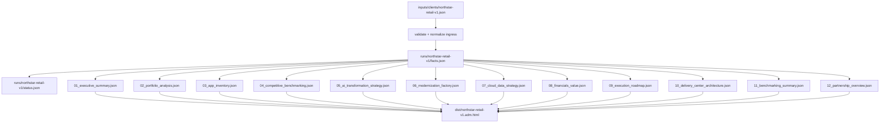

# High-Quality Fictional Client Ingress and End-to-End ADM Automation Design

## Executive summary

The hardest part of this assignment is not the renderer and not the 12 model calls. It is the ingress: one structured client dossier that is rich enough to support portfolio analysis, benchmarking, AI transformation, modernization dispositioning, cloud/data strategy, financials, roadmap, and delivery-center architecture without forcing the model to invent missing facts. Public portfolio-guidance from entity["company","Amazon Web Services","cloud provider"] explicitly asks for detailed portfolio discovery, application criticality, lifecycle, business cycle, dependencies, migration pattern, and a prioritized schedule; AWS MPA then uses application data for prioritization, dependency grouping, wave planning, and application-level cost estimation. entity["company","Google Cloud","cloud provider"] ties better portfolio discovery and migration-factory discipline to faster migration velocity, lower overlap cost, and faster ROI. entity["company","Microsoft Azure","cloud platform"] frames cloud adoption as a business-outcome program spanning strategy, plan, ready, adopt, govern, secure, and manage, with explicit data and AI scenarios. citeturn13view3turn13view1turn10view1turn10view2turn13view2turn12view0turn7view4

For the fictional client itself, open/public primary sources are enough. entity["company","Walmart","retailer"] publicly describes itself as a tech-powered omnichannel retailer at global scale; entity["company","Target","retailer"] emphasizes a $20 billion first-party digital business, loyalty-driven economics, and same-day services; and the entity["organization","National Retail Federation","retail trade association"] says current retail-tech execution is about scaling AI, connecting systems, and making real-time operational decisions. Those signals are sufficient to build a believable fictional composite without disguising one real company as another. citeturn7view8turn7view9turn7view10turn13view0

The current package’s visual benchmark is the uploaded Cisco HTML sample. fileciteturn0file0 The safe implementation is therefore:

**one client ingress file**  
→ **one normalized fact model**  
→ **one code-computed facts file**  
→ **12 retryable section payloads**  
→ **one self-contained final HTML**

There are also a few ambiguities in the package. These should be handled explicitly instead of being hidden inside prompts or code.

| Ambiguity | Current state | Safe implementation |
|---|---|---|
| Benchmark reference | Current package includes Cisco HTML; legacy master prompt mentions an Ameriprise benchmark | Parameterize benchmark source and section/visual map in config |
| “Business line intelligence” attachment | Mentioned in legacy prompt; unspecified in the current package | Put that material directly into ingress under `narrative_context`, `business_units`, `competitors`, `data_estate`, and `targets` |
| Model/provider | Unspecified | Build a provider adapter; require schema-constrained JSON output regardless of model |
| ROI denominator | Unspecified | Keep `tcv_5y_usd` as commercial context; compute `roi_pct` against transformation investment, not against all contracted ADM run-cost |
| 12 batches vs benchmark nav | Logical requirement is 12 sections; current benchmark visually groups content more tightly | Generate 12 logical section files; allow renderer merge-map for visual grouping |

The practical richness target should be treated like this:

| Richness tier | Apps | Business units | Competitors | Delivery centers | Data domains | Financial assumptions | Expected output quality |
|---|---:|---:|---:|---:|---:|---:|---|
| Minimal | 8–10 | 2–3 | 2 | 2 | 3 | 6–8 | Coherent, but still generic in benchmarking, cloud/data, and roadmap |
| Recommended | 12–18 | 4–5 | 3–4 | 3–4 | 5–7 | 12–16 | Strong enough for a substantive, client-specific ADM |
| Ideal | 20–30 | 5–7 | 4–5 | 4–5 | 8+ | 18–24 | Closest to a Cisco-quality output, with richer tables, more convincing roadmap, and better section depth |

## Benchmark-grounded ingress design

A good ingress should be **canonical JSON at runtime** and may optionally accept YAML for authoring convenience. The reason is operational: hash-based reruns, cached section payloads, and deterministic validation are easier with canonical JSON serialization. The field set should be wider than the brief’s minimum, because AWS MPA explicitly supports custom application attributes for prioritization, AWS portfolio guidance asks for criticality/lifecycle/business-cycle/dependencies/readiness, Google Cloud’s migration tooling expects discovery plus cost/business-case inputs, and Azure’s application/data modernization guidance expects app, data, and operating-model context rather than just infrastructure inventory. citeturn13view1turn10view1turn10view2turn7view3turn7view4turn12view0turn16view2turn16view0

### Top-level ingress schema

| Field | Type | Required | Example | Why it exists |
|---|---|---:|---|---|
| `client_id` | string | Yes | `northstar-retail-v1` | Stable run key, artifact naming, cache identity |
| `company` | object | Yes | `{name, industry, revenue, employees…}` | Executive summary, benchmarking context, commercial framing |
| `narrative_context` | object | Yes | `{strategic_priorities, pain_points, regulatory_context}` | Replaces the missing “business line intelligence” attachment |
| `annual_adm_spend_usd` | number | Yes | `95000000` | Base commercial input for TCV and business case |
| `business_units` | array<object> | Yes | `[{name:"Digital Commerce",...}]` | Portfolio analysis, org-specific app grouping, roadmap ownership |
| `apps` | array<object> | Yes | `[{id:"APP-001",...}]` | Core portfolio, disposition matrix, inventory table, savings model |
| `competitors` | array<object> | Yes | `[{name:"Walmart",...}]` | Competitive benchmarking and summary sections |
| `data_estate` | object | Yes | `{domains, current_platforms, integration_pain_points}` | Cloud & data strategy and AI transformation sections |
| `delivery_centers` | array<object> | Yes | `[{location:"Bengaluru, India",...}]` | Delivery-center architecture, support model, roadmap realism |
| `targets` | object | Yes | `{cloud_migration_pct:65,...}` | KPI cover, roadmap endpoints, narrative anchoring |
| `financial_assumptions` | object | Yes | `{contract_years:5,...}` | Code-only computation layer |
| `section_preferences` | object | No | `{currency:"USD", output_language:"en-US"}` | Formatting and benchmark-specific preferences |
| `provenance` | object | No | `{research_basis:"...", created_on:"2026-04-26"}` | Auditability and README traceability |
| `scope` | object | No | `{workloads_in_scope_pct:100}` | Useful if portfolio is partial rather than full-estate |

### `company` object

| Field | Type | Required | Example |
|---|---|---:|---|
| `name` | string | Yes | `Northstar Retail Group` |
| `industry` | string | Yes | `Retail` |
| `subsector` | string | No | `Omnichannel general merchandise and grocery` |
| `headquarters` | string | Yes | `Chicago, Illinois, USA` |
| `operating_regions` | array<string> | Yes | `["United States","Canada","United Kingdom"]` |
| `employees` | integer | Yes | `42000` |
| `annual_revenue_usd` | number | Yes | `12800000000` |
| `summary` | string | Yes | `Fictional composite retailer ...` |

### `apps[]` object

| Field | Type | Required | Example | Why it matters |
|---|---|---:|---|---|
| `id` | string | Yes | `APP-001` | Stable key across sections and calculations |
| `name` | string | Yes | `OrderCore` | Human-readable inventory and narrative |
| `business_unit` | string | Yes | `Digital Commerce` | BU-level portfolio slicing |
| `capability` | string | Yes | `Order management` | Portfolio narrative and benchmarking tie-in |
| `age_years` | integer | Yes | `14` | Technical-debt and modernization logic |
| `tech_stack` | array<string> | Yes | `["Java","Oracle","VMware"]` | Dispositioning and cloud/data narrative |
| `annual_run_cost_usd` | number | Yes | `12000000` | Legacy-cost reduction and inventory table |
| `business_criticality` | enum | Yes | `High` | Roadmap order, risk treatment, cutover planning |
| `integration_count` | integer | Yes | `18` | Dependency complexity and wave planning |
| `cloud_readiness` | enum | Yes | `Medium` | Rehost/replatform/refactor/rearchitect logic |
| `disposition` | enum | No | `Refactor` | Allows manual override; if absent, compute in code |
| `environment` | string | No | `Production` | Useful in prioritization rules |
| `user_scope` | enum | No | `External` | Helps AI strategy, CX, service model |
| `change_frequency` | enum | No | `High` | Helps value and modernization velocity logic |
| `data_sensitivity` | enum | No | `High` | Guides security/compliance narrative |
| `customer_facing` | boolean | No | `true` | AI/CX emphasis, resilience value |
| `functional_fit` | enum | No | `Low` | Strong signal for retire/replace decisions |

### `financial_assumptions` object

| Field | Type | Required | Example | Why it matters |
|---|---|---:|---|---|
| `contract_years` | integer | Yes | `5` | Required by brief |
| `transformation_investment_pct_of_tcv` | number | Yes | `0.22` | ROI denominator and investment phasing |
| `investment_curve` | array<number> | Yes | `[0.30,0.24,0.20,0.16,0.10]` | Year-by-year investment |
| `labor_share_pct_of_adm` | number | Yes | `0.64` | Workforce-savings base |
| `current_delivery_mix_pct` | object | Yes | `{onshore:70,nearshore:10,offshore:20}` | Baseline blended rate |
| `target_delivery_mix_pct` | object | Yes | `{onshore:35,nearshore:10,offshore:55}` | Target blended rate |
| `rate_card_usd_per_hour` | object | Yes | `{onshore:95,nearshore:55,offshore:32}` | Arbitrage model |
| `hours_per_fte_per_year` | integer | Yes | `1760` | FTE conversion |
| `automation_productivity_uplift_pct` | number | Yes | `20` | Productivity benefit stream |
| `productivity_value_capture_pct` | number | Yes | `55` | Conservative capture rate |
| `resilience_value_pct_of_adm` | number | Yes | `4.0` | Downtime/resilience proxy |
| `legacy_savings_rate_by_disposition_pct` | object | Yes | `{Retire:100,Rehost:15,...}` | Disposition-specific run-cost savings |
| `benefit_ramp_curves_pct` | object | Yes | `{workforce:[15,35,...]}` | Realization timing |

### Recommended delivery-center grounding

Official location sources are enough to support realistic delivery-center choices. entity["state","Karnataka","India"] positions Bengaluru as a major tech cluster; entity["state","Telangana","India"] publishes Hyderabad’s IT/ITeS scale and company presence; and national investment guidance highlights Tamil Nadu/Chennai as a strong SaaS and software-product base. That is sufficient to justify Bengaluru, Hyderabad, and Chennai for offshore roles, with an optional nearshore location for timezone overlap. citeturn7view6turn17view0turn7view7

## Sample fictional client ingress

The sample below is a **fictional retail composite**. Its omnichannel, loyalty, same-day, marketplace, inventory, and AI signals are grounded in public retail materials rather than copied from any one company. Walmart provides the omnichannel/operator scale signal; Target provides the digital/loyalty/fulfillment signal; NRF provides the current AI-and-real-time-operations signal. citeturn7view8turn7view9turn7view10turn13view0

### JSON variant

```json
{
  "client_id": "northstar-retail-v1",
  "company": {
    "name": "Northstar Retail Group",
    "industry": "Retail",
    "subsector": "Omnichannel general merchandise and grocery",
    "headquarters": "Chicago, Illinois, USA",
    "operating_regions": ["United States", "Canada", "United Kingdom"],
    "employees": 42000,
    "annual_revenue_usd": 12800000000,
    "summary": "Fictional composite retailer with stores, ecommerce, loyalty, merchandising, and supply-chain operations."
  },
  "narrative_context": {
    "strategic_priorities": [
      "Reduce legacy ADM run-cost and rebalance spend toward innovation",
      "Create a real-time inventory and fulfillment decision layer",
      "Improve digital conversion, loyalty personalization, and release velocity",
      "Industrialize support with AI-assisted operations and observability"
    ],
    "pain_points": [
      "Fragmented application estate across stores, ecommerce, merchandising, and supply chain",
      "High dependency on aging POS, order, and merchandising platforms",
      "Slow release cycles and duplicated data pipelines",
      "Inconsistent customer identity, offer, and returns experiences across channels"
    ],
    "regulatory_context": ["PCI DSS", "CCPA/CPRA", "GDPR for UK/EU customer data"]
  },
  "annual_adm_spend_usd": 95000000,
  "business_units": [
    {"name": "Digital Commerce", "owner_role": "Chief Digital Officer"},
    {"name": "Store Operations", "owner_role": "Chief Stores Officer"},
    {"name": "Merchandising", "owner_role": "Chief Merchandising Officer"},
    {"name": "Supply Chain", "owner_role": "Chief Supply Chain Officer"},
    {"name": "Customer & Loyalty", "owner_role": "Chief Marketing Officer"}
  ],
  "apps": [
    {"id": "APP-001", "name": "OrderCore", "business_unit": "Digital Commerce", "capability": "Order management", "age_years": 14, "tech_stack": ["Java", "Oracle", "VMware"], "annual_run_cost_usd": 12000000, "business_criticality": "High", "integration_count": 18, "cloud_readiness": "Medium", "disposition": "Refactor"},
    {"id": "APP-002", "name": "StoreOps Suite", "business_unit": "Store Operations", "capability": "Store operations and tasking", "age_years": 11, "tech_stack": [".NET", "SQL Server", "Windows Server"], "annual_run_cost_usd": 9500000, "business_criticality": "High", "integration_count": 14, "cloud_readiness": "Medium", "disposition": "Replatform"},
    {"id": "APP-003", "name": "SupplyMesh", "business_unit": "Supply Chain", "capability": "Warehouse and transport orchestration", "age_years": 16, "tech_stack": ["Java", "IBM MQ", "DB2"], "annual_run_cost_usd": 8700000, "business_criticality": "High", "integration_count": 21, "cloud_readiness": "Low", "disposition": "Rearchitect"},
    {"id": "APP-004", "name": "Loyalty360", "business_unit": "Customer & Loyalty", "capability": "Loyalty platform", "age_years": 8, "tech_stack": ["Node.js", "PostgreSQL", "Kubernetes"], "annual_run_cost_usd": 6400000, "business_criticality": "High", "integration_count": 12, "cloud_readiness": "High", "disposition": "Refactor"},
    {"id": "APP-005", "name": "MerchPlanner", "business_unit": "Merchandising", "capability": "Merchandise planning", "age_years": 13, "tech_stack": ["SAP BW", "ABAP", "HANA"], "annual_run_cost_usd": 5200000, "business_criticality": "Medium", "integration_count": 9, "cloud_readiness": "Medium", "disposition": "Replatform"},
    {"id": "APP-006", "name": "InvoiceHub", "business_unit": "Merchandising", "capability": "Vendor invoicing", "age_years": 10, "tech_stack": ["Java", "Tomcat", "MySQL"], "annual_run_cost_usd": 4900000, "business_criticality": "Medium", "integration_count": 8, "cloud_readiness": "High", "disposition": "Rehost"},
    {"id": "APP-007", "name": "PricingEngine", "business_unit": "Digital Commerce", "capability": "Pricing and promotions", "age_years": 9, "tech_stack": ["Python", "Redis", "PostgreSQL"], "annual_run_cost_usd": 5600000, "business_criticality": "High", "integration_count": 16, "cloud_readiness": "High", "disposition": "Rearchitect"},
    {"id": "APP-008", "name": "WarehouseMobile", "business_unit": "Supply Chain", "capability": "Handheld warehouse workflows", "age_years": 4, "tech_stack": ["React Native", "Go", "PostgreSQL"], "annual_run_cost_usd": 3800000, "business_criticality": "Medium", "integration_count": 6, "cloud_readiness": "High", "disposition": "Retain"},
    {"id": "APP-009", "name": "CustomerID", "business_unit": "Customer & Loyalty", "capability": "Customer identity and consent", "age_years": 7, "tech_stack": ["Java", "Kafka", "PostgreSQL"], "annual_run_cost_usd": 4500000, "business_criticality": "High", "integration_count": 15, "cloud_readiness": "High", "disposition": "Refactor"},
    {"id": "APP-010", "name": "POSLegacy", "business_unit": "Store Operations", "capability": "Legacy point of sale controller", "age_years": 19, "tech_stack": ["C++", "AIX", "Oracle"], "annual_run_cost_usd": 7900000, "business_criticality": "High", "integration_count": 11, "cloud_readiness": "Low", "disposition": "Retire"},
    {"id": "APP-011", "name": "CampaignMart", "business_unit": "Customer & Loyalty", "capability": "Campaign execution", "age_years": 12, "tech_stack": ["Salesforce Marketing Cloud", "SQL Server"], "annual_run_cost_usd": 4300000, "business_criticality": "Medium", "integration_count": 10, "cloud_readiness": "Medium", "disposition": "Replatform"},
    {"id": "APP-012", "name": "ReturnsPortal", "business_unit": "Digital Commerce", "capability": "Returns case management", "age_years": 9, "tech_stack": [".NET", "SQL Server", "IIS"], "annual_run_cost_usd": 3600000, "business_criticality": "Medium", "integration_count": 7, "cloud_readiness": "High", "disposition": "Rehost"}
  ],
  "competitors": [
    {"name": "Walmart", "segment": "Big-box omnichannel retail", "public_strengths": ["Mass-scale omnichannel fulfillment", "Tech-powered retail operating model"], "assumed_client_gap": ["Lower fulfillment automation maturity", "Less integrated store-to-digital orchestration"]},
    {"name": "Target", "segment": "Omnichannel general merchandise", "public_strengths": ["Large first-party digital business", "Loyalty-led same-day services"], "assumed_client_gap": ["Weaker loyalty monetization", "Lower offer personalization consistency"]},
    {"name": "Amazon", "segment": "Digital-native retail and marketplace", "public_strengths": ["Marketplace scale", "High-velocity product experimentation"], "assumed_client_gap": ["Slower release cadence", "Less advanced marketplace tooling"]}
  ],
  "data_estate": {
    "domains": [
      "Customer and loyalty",
      "Product and catalog",
      "Orders and returns",
      "Pricing and promotions",
      "Inventory and fulfillment",
      "Supplier and merchandising"
    ],
    "current_platforms": ["Oracle", "SQL Server", "SAP BW/HANA", "S3-compatible object storage", "Kafka"],
    "integration_pain_points": [
      "Duplicate customer records across loyalty, ecommerce, and service applications",
      "Batch-oriented merchandise and inventory interfaces",
      "Limited real-time eventing for pricing, stock, and returns"
    ]
  },
  "delivery_centers": [
    {"location": "Bengaluru, India", "type": "Offshore", "primary_roles": ["Modernization engineering", "Platform engineering", "SRE"], "strategic_reason": "Large engineering talent pool for cloud, platform, and modernization work"},
    {"location": "Hyderabad, India", "type": "Offshore", "primary_roles": ["Data engineering", "QA automation", "Customer analytics"], "strategic_reason": "Strong IT/ITeS ecosystem and enterprise engineering base"},
    {"location": "Chennai, India", "type": "Offshore", "primary_roles": ["Application support", "ERP integration", "Release management"], "strategic_reason": "Strong software product and enterprise delivery talent"},
    {"location": "Guadalajara, Mexico", "type": "Nearshore", "primary_roles": ["L2 support", "Business analysis", "Product operations"], "strategic_reason": "Timezone overlap for North America operations"}
  ],
  "targets": {
    "cloud_migration_pct": 65,
    "legacy_cost_reduction_pct": 28,
    "release_frequency_improvement_pct": 45,
    "change_failure_rate_reduction_pct": 25,
    "offshore_delivery_mix_target_pct": 55,
    "innovation_budget_shift_pct": 20
  },
  "financial_assumptions": {
    "contract_years": 5,
    "transformation_investment_pct_of_tcv": 0.22,
    "investment_curve": [0.30, 0.24, 0.20, 0.16, 0.10],
    "labor_share_pct_of_adm": 0.64,
    "current_delivery_mix_pct": {"onshore": 70, "nearshore": 10, "offshore": 20},
    "target_delivery_mix_pct": {"onshore": 35, "nearshore": 10, "offshore": 55},
    "rate_card_usd_per_hour": {"onshore": 95, "nearshore": 55, "offshore": 32},
    "hours_per_fte_per_year": 1760,
    "automation_productivity_uplift_pct": 20,
    "productivity_value_capture_pct": 55,
    "resilience_value_pct_of_adm": 4.0,
    "legacy_savings_rate_by_disposition_pct": {"Retire": 100, "Retain": 3, "Rehost": 15, "Replatform": 25, "Refactor": 32, "Rearchitect": 40},
    "benefit_ramp_curves_pct": {
      "workforce": [15, 35, 60, 85, 100],
      "legacy": [8, 30, 58, 82, 100],
      "productivity": [10, 35, 65, 85, 100],
      "resilience": [10, 35, 65, 85, 100]
    }
  },
  "section_preferences": {
    "benchmark_reference": "Cisco sample in the current package; an Ameriprise benchmark is referenced in the legacy master prompt but is unspecified here.",
    "output_language": "en-US",
    "currency": "USD",
    "no_placeholder_text": true
  },
  "provenance": {
    "research_basis": "Fictional composite inspired by public retail annual reports, NRF retail-tech signals, and cloud modernization reference architectures.",
    "created_on": "2026-04-26"
  }
}
```

### YAML variant

```yaml
client_id: northstar-retail-v1
company:
  name: Northstar Retail Group
  industry: Retail
  subsector: Omnichannel general merchandise and grocery
  headquarters: Chicago, Illinois, USA
  operating_regions: [United States, Canada, United Kingdom]
  employees: 42000
  annual_revenue_usd: 12800000000
  summary: Fictional composite retailer with stores, ecommerce, loyalty, merchandising, and supply-chain operations.

narrative_context:
  strategic_priorities:
    - Reduce legacy ADM run-cost and rebalance spend toward innovation
    - Create a real-time inventory and fulfillment decision layer
    - Improve digital conversion, loyalty personalization, and release velocity
    - Industrialize support with AI-assisted operations and observability
  pain_points:
    - Fragmented application estate across stores, ecommerce, merchandising, and supply chain
    - High dependency on aging POS, order, and merchandising platforms
    - Slow release cycles and duplicated data pipelines
    - Inconsistent customer identity, offer, and returns experiences across channels
  regulatory_context: [PCI DSS, CCPA/CPRA, GDPR for UK/EU customer data]

annual_adm_spend_usd: 95000000

business_units:
  - {name: Digital Commerce, owner_role: Chief Digital Officer}
  - {name: Store Operations, owner_role: Chief Stores Officer}
  - {name: Merchandising, owner_role: Chief Merchandising Officer}
  - {name: Supply Chain, owner_role: Chief Supply Chain Officer}
  - {name: "Customer & Loyalty", owner_role: Chief Marketing Officer}

apps:
  - {id: APP-001, name: OrderCore, business_unit: Digital Commerce, capability: Order management, age_years: 14, tech_stack: [Java, Oracle, VMware], annual_run_cost_usd: 12000000, business_criticality: High, integration_count: 18, cloud_readiness: Medium, disposition: Refactor}
  - {id: APP-002, name: StoreOps Suite, business_unit: Store Operations, capability: Store operations and tasking, age_years: 11, tech_stack: [".NET", SQL Server, Windows Server], annual_run_cost_usd: 9500000, business_criticality: High, integration_count: 14, cloud_readiness: Medium, disposition: Replatform}
  - {id: APP-003, name: SupplyMesh, business_unit: Supply Chain, capability: Warehouse and transport orchestration, age_years: 16, tech_stack: [Java, IBM MQ, DB2], annual_run_cost_usd: 8700000, business_criticality: High, integration_count: 21, cloud_readiness: Low, disposition: Rearchitect}
  - {id: APP-004, name: Loyalty360, business_unit: "Customer & Loyalty", capability: Loyalty platform, age_years: 8, tech_stack: [Node.js, PostgreSQL, Kubernetes], annual_run_cost_usd: 6400000, business_criticality: High, integration_count: 12, cloud_readiness: High, disposition: Refactor}
  - {id: APP-005, name: MerchPlanner, business_unit: Merchandising, capability: Merchandise planning, age_years: 13, tech_stack: ["SAP BW", ABAP, HANA], annual_run_cost_usd: 5200000, business_criticality: Medium, integration_count: 9, cloud_readiness: Medium, disposition: Replatform}
  - {id: APP-006, name: InvoiceHub, business_unit: Merchandising, capability: Vendor invoicing, age_years: 10, tech_stack: [Java, Tomcat, MySQL], annual_run_cost_usd: 4900000, business_criticality: Medium, integration_count: 8, cloud_readiness: High, disposition: Rehost}
  - {id: APP-007, name: PricingEngine, business_unit: Digital Commerce, capability: Pricing and promotions, age_years: 9, tech_stack: [Python, Redis, PostgreSQL], annual_run_cost_usd: 5600000, business_criticality: High, integration_count: 16, cloud_readiness: High, disposition: Rearchitect}
  - {id: APP-008, name: WarehouseMobile, business_unit: Supply Chain, capability: Handheld warehouse workflows, age_years: 4, tech_stack: ["React Native", Go, PostgreSQL], annual_run_cost_usd: 3800000, business_criticality: Medium, integration_count: 6, cloud_readiness: High, disposition: Retain}
  - {id: APP-009, name: CustomerID, business_unit: "Customer & Loyalty", capability: Customer identity and consent, age_years: 7, tech_stack: [Java, Kafka, PostgreSQL], annual_run_cost_usd: 4500000, business_criticality: High, integration_count: 15, cloud_readiness: High, disposition: Refactor}
  - {id: APP-010, name: POSLegacy, business_unit: Store Operations, capability: Legacy point of sale controller, age_years: 19, tech_stack: ["C++", AIX, Oracle], annual_run_cost_usd: 7900000, business_criticality: High, integration_count: 11, cloud_readiness: Low, disposition: Retire}
  - {id: APP-011, name: CampaignMart, business_unit: "Customer & Loyalty", capability: Campaign execution, age_years: 12, tech_stack: ["Salesforce Marketing Cloud", SQL Server], annual_run_cost_usd: 4300000, business_criticality: Medium, integration_count: 10, cloud_readiness: Medium, disposition: Replatform}
  - {id: APP-012, name: ReturnsPortal, business_unit: Digital Commerce, capability: Returns case management, age_years: 9, tech_stack: [".NET", SQL Server, IIS], annual_run_cost_usd: 3600000, business_criticality: Medium, integration_count: 7, cloud_readiness: High, disposition: Rehost}

competitors:
  - name: Walmart
    segment: Big-box omnichannel retail
    public_strengths: [Mass-scale omnichannel fulfillment, Tech-powered retail operating model]
    assumed_client_gap: [Lower fulfillment automation maturity, Less integrated store-to-digital orchestration]
  - name: Target
    segment: Omnichannel general merchandise
    public_strengths: [Large first-party digital business, Loyalty-led same-day services]
    assumed_client_gap: [Weaker loyalty monetization, Lower offer personalization consistency]
  - name: Amazon
    segment: Digital-native retail and marketplace
    public_strengths: [Marketplace scale, High-velocity product experimentation]
    assumed_client_gap: [Slower release cadence, Less advanced marketplace tooling]

data_estate:
  domains:
    - Customer and loyalty
    - Product and catalog
    - Orders and returns
    - Pricing and promotions
    - Inventory and fulfillment
    - Supplier and merchandising
  current_platforms: [Oracle, SQL Server, SAP BW/HANA, S3-compatible object storage, Kafka]
  integration_pain_points:
    - Duplicate customer records across loyalty, ecommerce, and service applications
    - Batch-oriented merchandise and inventory interfaces
    - Limited real-time eventing for pricing, stock, and returns

delivery_centers:
  - {location: "Bengaluru, India", type: Offshore, primary_roles: [Modernization engineering, Platform engineering, SRE], strategic_reason: "Large engineering talent pool for cloud, platform, and modernization work"}
  - {location: "Hyderabad, India", type: Offshore, primary_roles: [Data engineering, QA automation, Customer analytics], strategic_reason: "Strong IT/ITeS ecosystem and enterprise engineering base"}
  - {location: "Chennai, India", type: Offshore, primary_roles: [Application support, ERP integration, Release management], strategic_reason: "Strong software product and enterprise delivery talent"}
  - {location: "Guadalajara, Mexico", type: Nearshore, primary_roles: ["L2 support", "Business analysis", "Product operations"], strategic_reason: "Timezone overlap for North America operations"}

targets:
  cloud_migration_pct: 65
  legacy_cost_reduction_pct: 28
  release_frequency_improvement_pct: 45
  change_failure_rate_reduction_pct: 25
  offshore_delivery_mix_target_pct: 55
  innovation_budget_shift_pct: 20

financial_assumptions:
  contract_years: 5
  transformation_investment_pct_of_tcv: 0.22
  investment_curve: [0.30, 0.24, 0.20, 0.16, 0.10]
  labor_share_pct_of_adm: 0.64
  current_delivery_mix_pct: {onshore: 70, nearshore: 10, offshore: 20}
  target_delivery_mix_pct: {onshore: 35, nearshore: 10, offshore: 55}
  rate_card_usd_per_hour: {onshore: 95, nearshore: 55, offshore: 32}
  hours_per_fte_per_year: 1760
  automation_productivity_uplift_pct: 20
  productivity_value_capture_pct: 55
  resilience_value_pct_of_adm: 4.0
  legacy_savings_rate_by_disposition_pct: {Retire: 100, Retain: 3, Rehost: 15, Replatform: 25, Refactor: 32, Rearchitect: 40}
  benefit_ramp_curves_pct:
    workforce: [15, 35, 60, 85, 100]
    legacy: [8, 30, 58, 82, 100]
    productivity: [10, 35, 65, 85, 100]
    resilience: [10, 35, 65, 85, 100]

section_preferences:
  benchmark_reference: Cisco sample in the current package; an Ameriprise benchmark is referenced in the legacy master prompt but is unspecified here.
  output_language: en-US
  currency: USD
  no_placeholder_text: true

provenance:
  research_basis: Fictional composite inspired by public retail annual reports, NRF retail-tech signals, and cloud modernization reference architectures.
  created_on: "2026-04-26"
```

## Richness targets and section coverage

Recommended object counts are not arbitrary. They come from the structure implied by the benchmark plus public portfolio discovery guidance: applications need enough spread for prioritization and wave planning; dependencies and complexity must be rich enough for a modernization matrix; company-level context must be rich enough for business case and competitive narrative; and delivery/data fields must be explicit enough to avoid generic “cloud and AI” filler. Google’s migration-factory and DORA materials both reinforce that you get better outcomes when you define baselines, wave plans, ownership, and measurable change rather than writing vague aspirational prose. citeturn13view3turn10view2turn9view0turn15view2turn15view0

### Recommended dataset sizes

| Ingress block | Minimal | Recommended | Ideal | Why it matters |
|---|---:|---:|---:|---|
| Applications | 8–10 | 12–18 | 20–30 | Portfolio analysis, matrix density, savings realism |
| Business units | 2–3 | 4–5 | 5–7 | Prevents monolithic/generic narrative |
| Competitors | 2 | 3–4 | 5 | Better benchmarking and gap triangulation |
| Delivery centers | 2 | 3–4 | 4–5 | Stronger global delivery architecture |
| Data domains | 3 | 5–7 | 8+ | Makes cloud/data and AI sections credible |
| Financial assumption fields | 6–8 | 12–16 | 18–24 | Enables code-only value modeling |
| Dependency signals | 0–10 | 20–40 | 50+ | Better wave planning and factory logic |
| Explicit targets/KPIs | 4 | 6–8 | 10+ | Better cover KPIs and roadmap endpoints |

### Why each input block matters for each of the 12 sections

| Section | Primary inputs | Minimum richness needed | Why it matters |
|---|---|---|---|
| Executive Summary | `company`, `narrative_context`, `targets`, `facts.json` | 4 strategic priorities, 4 pain points, full KPIs | Without these, the summary becomes generic and repetitive |
| Portfolio Analysis | `apps`, `business_units` | 12+ apps across 4+ BUs | Needed for mix, age, risk, and estate-shape commentary |
| App Inventory | `apps` | Complete app list with cost and disposition | Drives the deep-dive inventory table |
| Competitive Benchmarking | `competitors`, `company`, `targets` | 3 competitors with explicit gaps | Prevents empty “market landscape” prose |
| AI Transformation Strategy | `narrative_context`, `data_estate`, `targets` | 3+ AI pain points or target outcomes | Needed for concrete AI use cases and operating model |
| Modernization Factory | `apps`, `delivery_centers`, `targets` | Dispositions, integration counts, cloud readiness | Powers the six-column strategy matrix and wave design |
| Cloud & Data Strategy | `data_estate`, `apps`, `targets` | 5+ domains, current platforms, pain points | Prevents shallow “move to cloud/data lake” wording |
| Financials & Value | `annual_adm_spend_usd`, `financial_assumptions`, computed facts | Full financial assumptions | All numbers must be code-derived |
| Execution Roadmap | `apps`, `targets`, `facts.json` | Waves / phases / target dates | Needed for year-by-year sequencing |
| Delivery Center Architecture | `delivery_centers`, `business_units`, `apps` | 3+ centers with roles | Makes location choice and handoffs explicit |
| Benchmarking Summary | `competitors`, computed deltas | 3 competitor summaries | Produces a before/after competitive close |
| Partnership Overview | `targets`, governance assumptions, delivery model | Steering cadence and KPI set | Needed for non-hand-wavy partnership language |

## End-to-end pipeline, financial logic, and artifacts

A good pipeline mirrors migration-factory discipline: one authoritative input model, one computed fact layer, checkpointed section execution, and a dashboard/status artifact for reruns and auditability. AWS and Google guidance both push toward detailed business cases, workload-level inventories, wave planning, and status-driven execution rather than restart-from-zero workflows. citeturn11view0turn11view1turn13view2turn9view0turn7view4

### Pipeline timeline



### Minimal runnable repo structure

```text
adm-automation/
├── README.md
├── assets/
│   └── benchmarks/
│       └── Cisco_ADM.html
├── config/
│   ├── benchmark.current.yaml
│   └── client_ingress.schema.json
├── inputs/
│   └── clients/
│       ├── northstar-retail-v1.json
│       └── northstar-retail-v1.yaml
├── runs/
│   └── northstar-retail-v1/
│       ├── facts.json
│       ├── status.json
│       └── sections/
│           ├── 01_executive_summary.json
│           ├── 02_portfolio_analysis.json
│           ├── 03_app_inventory.json
│           ├── 04_competitive_benchmarking.json
│           ├── 05_ai_transformation_strategy.json
│           ├── 06_modernization_factory.json
│           ├── 07_cloud_data_strategy.json
│           ├── 08_financials_value.json
│           ├── 09_execution_roadmap.json
│           ├── 10_delivery_center_architecture.json
│           ├── 11_benchmarking_summary.json
│           └── 12_partnership_overview.json
├── dist/
│   └── northstar-retail-v1.adm.html
├── src/
│   ├── adm/cli.py
│   ├── adm/ingress.py
│   ├── adm/facts.py
│   ├── adm/prompts.py
│   ├── adm/generate.py
│   ├── adm/render.py
│   └── adm/validate.py
└── tests/
    ├── test_facts.py
    ├── test_prompts.py
    ├── test_renderer.py
    └── test_end_to_end.py
```

### Core pipeline artifacts

| Artifact | Exact filename | Example payload |
|---|---|---|
| Ingress | `inputs/clients/northstar-retail-v1.json` | `{"client_id":"northstar-retail-v1","annual_adm_spend_usd":95000000,...}` |
| Run status | `runs/northstar-retail-v1/status.json` | `{"run_id":"northstar-retail-v1","sections":{"01_executive_summary":{"status":"done","retries":0}}}` |
| Facts | `runs/northstar-retail-v1/facts.json` | `{"tcv_5y_usd":475000000,"roi_pct":49.94,...}` |
| Final HTML | `dist/northstar-retail-v1.adm.html` | `<!doctype html><html><head>...inline css/js...</head><body>...` |

### Example `facts.json`

```json
{
  "client_id": "northstar-retail-v1",
  "annual_adm_spend_usd": 95000000,
  "tcv_5y_usd": 475000000,
  "annual_average_contract_value_usd": 95000000,
  "transformation_investment_total_usd": 104500000.0,
  "investment_by_year_usd": [31350000.0, 25080000.0, 20900000.0, 16720000.0, 10450000.0],
  "workforce_savings_rate_arbitrage_cumulative_usd": 50445000.0,
  "legacy_cost_reduction_cumulative_usd": 75301860.0,
  "productivity_value_cumulative_usd": 19729600.0,
  "resilience_value_cumulative_usd": 11210000.0,
  "cumulative_business_value_usd": 156686460.0,
  "net_value_created_usd": 52186460.0,
  "roi_pct": 49.94,
  "yearly_business_value_usd": [5780760.0, 17781900.0, 32787660.0, 45661140.0, 54675000.0],
  "disposition_counts": {
    "Retire": 1,
    "Retain": 1,
    "Rehost": 2,
    "Replatform": 3,
    "Refactor": 3,
    "Rearchitect": 2
  },
  "apps_in_scope": 12,
  "business_units_in_scope": 5,
  "delivery_center_count": 4
}
```

### Section artifact filenames and example content envelopes

| File | Example JSON snippet |
|---|---|
| `01_executive_summary.json` | `{"section_id":"executive_summary","status":"complete","content":{"headline":"Rebalance 20% of spend toward innovation","kpis":[...]}}` |
| `02_portfolio_analysis.json` | `{"section_id":"portfolio_analysis","status":"complete","content":{"portfolio_distribution":{...},"age_risk_summary":{...}}}` |
| `03_app_inventory.json` | `{"section_id":"app_inventory","status":"complete","content":{"app_table":[...],"priority_watchlist":[...]}}` |
| `04_competitive_benchmarking.json` | `{"section_id":"competitive_benchmarking","status":"complete","content":{"competitor_cards":[...],"gap_summary":[...]}}` |
| `05_ai_transformation_strategy.json` | `{"section_id":"ai_transformation_strategy","status":"complete","content":{"ai_use_cases":[...],"operating_model":{...}}}` |
| `06_modernization_factory.json` | `{"section_id":"modernization_factory","status":"complete","content":{"strategy_matrix":[...],"wave_groups":[...]}}` |
| `07_cloud_data_strategy.json` | `{"section_id":"cloud_data_strategy","status":"complete","content":{"data_pillars":[...],"target_state":{...}}}` |
| `08_financials_value.json` | `{"section_id":"financials_value","status":"complete","content":{"kpis":[...],"investment_chart":{...},"value_mix":{...}}}` |
| `09_execution_roadmap.json` | `{"section_id":"execution_roadmap","status":"complete","content":{"year_plan":[...],"milestones":[...]}}` |
| `10_delivery_center_architecture.json` | `{"section_id":"delivery_center_architecture","status":"complete","content":{"site_cards":[...],"role_distribution":{...}}}` |
| `11_benchmarking_summary.json` | `{"section_id":"benchmarking_summary","status":"complete","content":{"before_after":{...},"scorecard":[...]}}` |
| `12_partnership_overview.json` | `{"section_id":"partnership_overview","status":"complete","content":{"governance_model":{...},"cadence":[...],"steering_kpis":[...]}}` |

### Financial calculation algorithm

The brief requires that **code generates numbers**. The cleanest approach is to separate **commercial context** from **ROI denominator**:

- `tcv_5y_usd` = 5-year commercial contract value
- `transformation_investment_total_usd` = modernization investment denominator for ROI
- `cumulative_business_value_usd` = sum of code-defined benefit streams

```python
def compute_facts(client):
    spend = client["annual_adm_spend_usd"]
    fa = client["financial_assumptions"]

    years = fa["contract_years"]
    tcv_5y = spend * years

    # Commercial context vs ROI denominator
    investment_total = tcv_5y * fa["transformation_investment_pct_of_tcv"]
    investment_by_year = [investment_total * w for w in fa["investment_curve"]]

    # Workforce savings from delivery arbitrage
    labor_spend = spend * fa["labor_share_pct_of_adm"]
    current_rate = blended_rate(fa["current_delivery_mix_pct"], fa["rate_card_usd_per_hour"])
    target_rate  = blended_rate(fa["target_delivery_mix_pct"],  fa["rate_card_usd_per_hour"])
    ftes = labor_spend / (current_rate * fa["hours_per_fte_per_year"])
    annual_workforce_savings = ftes * fa["hours_per_fte_per_year"] * (current_rate - target_rate)

    # Legacy run-cost reduction from dispositioned applications
    annual_legacy_savings = 0
    for app in client["apps"]:
        disp = app.get("disposition") or auto_disposition(app)
        pct = fa["legacy_savings_rate_by_disposition_pct"][disp] / 100.0
        annual_legacy_savings += app["annual_run_cost_usd"] * pct

    # Productivity / agility capture
    annual_productivity_value = (
        labor_spend
        * (fa["automation_productivity_uplift_pct"] / 100.0)
        * (fa["productivity_value_capture_pct"] / 100.0)
    )

    # Resilience / downtime-avoidance proxy
    annual_resilience_value = spend * (fa["resilience_value_pct_of_adm"] / 100.0)

    # Apply multi-year realization ramps
    work_curve = [x / 100.0 for x in fa["benefit_ramp_curves_pct"]["workforce"]]
    leg_curve  = [x / 100.0 for x in fa["benefit_ramp_curves_pct"]["legacy"]]
    prod_curve = [x / 100.0 for x in fa["benefit_ramp_curves_pct"]["productivity"]]
    res_curve  = [x / 100.0 for x in fa["benefit_ramp_curves_pct"]["resilience"]]

    yearly_business_value = []
    for i in range(years):
        value_i = (
            annual_workforce_savings * work_curve[i]
            + annual_legacy_savings * leg_curve[i]
            + annual_productivity_value * prod_curve[i]
            + annual_resilience_value * res_curve[i]
        )
        yearly_business_value.append(value_i)

    cumulative_business_value = sum(yearly_business_value)
    net_value_created = cumulative_business_value - investment_total
    roi_pct = (net_value_created / investment_total) * 100.0

    return {
        "tcv_5y_usd": round(tcv_5y, 2),
        "transformation_investment_total_usd": round(investment_total, 2),
        "investment_by_year_usd": [round(x, 2) for x in investment_by_year],
        "workforce_savings_rate_arbitrage_cumulative_usd": round(annual_workforce_savings * sum(work_curve), 2),
        "legacy_cost_reduction_cumulative_usd": round(annual_legacy_savings * sum(leg_curve), 2),
        "productivity_value_cumulative_usd": round(annual_productivity_value * sum(prod_curve), 2),
        "resilience_value_cumulative_usd": round(annual_resilience_value * sum(res_curve), 2),
        "yearly_business_value_usd": [round(x, 2) for x in yearly_business_value],
        "cumulative_business_value_usd": round(cumulative_business_value, 2),
        "net_value_created_usd": round(net_value_created, 2),
        "roi_pct": round(roi_pct, 2),
    }
```

### Optional constrained ROI maximization

The legacy prompt asks for the **highest realistically possible ROI**. The safe way to implement that is as a constrained search, not a hallucinated large number.

```python
def optimize_for_highest_realistic_roi(client):
    guardrails = {
        "max_target_offshore_pct": 60,
        "max_automation_uplift_pct": 25,
        "max_resilience_value_pct_of_adm": 5.0,
        "max_replatform_savings_pct": 30,
        "max_refactor_savings_pct": 35,
        "max_rearchitect_savings_pct": 45,
        "max_roi_pct": 85
    }

    best = None
    for offshore_target in [45, 50, 55, 60]:
        for automation in [12, 15, 18, 20, 22, 25]:
            trial = deepcopy(client)
            trial["financial_assumptions"]["target_delivery_mix_pct"]["offshore"] = offshore_target
            trial["financial_assumptions"]["target_delivery_mix_pct"]["onshore"] = 100 - offshore_target - 10
            trial["financial_assumptions"]["automation_productivity_uplift_pct"] = automation

            facts = compute_facts(trial)

            if facts["roi_pct"] > guardrails["max_roi_pct"]:
                continue

            if best is None or facts["roi_pct"] > best["facts"]["roi_pct"]:
                best = {"client": trial, "facts": facts}

    return best
```

### Automated disposition algorithm

Public cloud guidance converges on similar rationalization families: retire/retain/rehost/replatform/refactor/rearchitect. The score-based approach below gives consistent, auditable outcomes and still allows manual overrides. citeturn13view3turn7view2

```python
def auto_disposition(app):
    if "disposition" in app and app["disposition"]:
        return app["disposition"]  # manual override wins

    age = app["age_years"]
    cost = app["annual_run_cost_usd"]
    criticality = app["business_criticality"]
    integrations = app["integration_count"]
    readiness = app["cloud_readiness"]

    # Hard retirement signals
    if age >= 15 and readiness == "Low" and criticality != "High":
        return "Retire"

    # Keep modern apps unless there is a strong reason to change
    if age <= 5 and readiness == "High" and integrations <= 8:
        return "Retain"

    # Low-change, low-readiness workloads
    if readiness == "Low" and integrations <= 10:
        return "Rehost"

    # Moderate complexity, moderate readiness
    if readiness in ["Medium", "High"] and integrations <= 14 and age <= 12:
        return "Replatform"

    # Strategic / customer / identity / pricing / loyalty systems
    strategic_capabilities = {"Order management", "Pricing and promotions", "Customer identity and consent", "Loyalty platform"}
    if app["capability"] in strategic_capabilities and readiness == "High":
        return "Refactor"

    # Highly coupled, aging, strategically important platforms
    if criticality == "High" and integrations >= 15 and age >= 8:
        return "Rearchitect"

    return "Replatform"
```

### Financial phasing example for the sample client

This example uses the sample ingress and the algorithms above.

```text
Year 1  Investment  $31.35M  ████████████████   Business value   $5.78M   ███
Year 2  Investment  $25.08M  █████████████     Business value  $17.78M   █████████
Year 3  Investment  $20.90M  ███████████       Business value  $32.79M   ████████████████
Year 4  Investment  $16.72M  █████████         Business value  $45.66M   ██████████████████████
Year 5  Investment  $10.45M  █████             Business value  $54.68M   ██████████████████████████

5-Year TCV:                     $475.00M
Transformation investment:      $104.50M
Cumulative business value:      $156.69M
Net value created:               $52.19M
ROI:                              49.94%
```

### Sample HTML mockup diagram

```text
┌──────────────────────────────┬──────────────────────────────────────────────────────────────┐
│ Fixed dark sidebar           │ Cover                                                        │
│ • Executive Summary          │ ┌──────────────────────────────────────────────────────────┐ │
│ • Portfolio Analysis         │ │ Client name + subtitle                                   │ │
│ • App Inventory              │ │ KPI grid: TCV | ROI | Net Value | Legacy Reduction      │ │
│ • Competitive Benchmarking   │ └──────────────────────────────────────────────────────────┘ │
│ • AI Transformation          │                                                              │
│ • Modernization Factory      │ Section body                                                 │
│ • Cloud & Data Strategy      │ ┌──────────────────────────────────────────────────────────┐ │
│ • Financials & Value         │ │ Narrative block                                          │ │
│ • Execution Roadmap          │ │ Cards / tables / charts                                  │ │
│ • Delivery Center Arch       │ │ Six-column modernization matrix                          │ │
│ • Benchmarking Summary       │ │ 5-year financial chart                                   │ │
│ • Partnership Overview       │ │ Roadmap timeline                                          │ │
│                              │ │ Delivery-center cards                                     │ │
│                              │ └──────────────────────────────────────────────────────────┘ │
└──────────────────────────────┴──────────────────────────────────────────────────────────────┘
```

## Model prompting, validation, repo, and submission

The clean design is **section-first, schema-first, retryable generation**. The model writes language and structured section payloads; code provides facts, numbers, headings, and benchmark rules. This keeps the run resumable and prevents silent number drift.

### Generic section prompt skeleton

```text
SYSTEM
You are generating one section of a 12-section ADM document.
You must match the benchmark's section depth, table density, and analytical tone.
You may only use facts, assumptions, and financial values supplied in this request.
Never invent financial figures.
Never introduce placeholders, TODOs, or generic filler.
Return valid JSON that conforms exactly to SECTION_SCHEMA_JSON.

USER
SECTION_ID: {{section_id}}
SECTION_TITLE: {{section_title}}
BENCHMARK_PROFILE_JSON:
{{benchmark_profile_json}}

CLIENT_FACTS_JSON:
{{client_facts_json}}

COMPUTED_FACTS_JSON:
{{computed_facts_json}}

SECTION_SPEC_JSON:
{{section_spec_json}}

SECTION_SCHEMA_JSON:
{{section_schema_json}}

OUTPUT RULES
- Use exact headings requested.
- Reuse supplied numbers verbatim.
- If a fact is absent, omit the claim.
- Keep content specific to this client.
- Output JSON only.
```

### Section-by-section prompt templates

| Section | Inject these facts | Required output keys | Validation checks |
|---|---|---|---|
| Executive Summary | company, priorities, pain points, top KPIs, targets | `headline`, `summary_paragraphs`, `kpis`, `strategic_imperatives` | All KPI values must exist in `facts.json`; no new numbers |
| Portfolio Analysis | app list, BU mapping, age stats, disposition counts | `portfolio_distribution`, `risk_profile`, `findings` | BU counts sum to app count; avg age matches code |
| App Inventory | full apps array, top-cost apps, dispositions | `inventory_table`, `watchlist`, `inventory_commentary` | Table row count = app count; run-cost totals reconcile |
| Competitive Benchmarking | competitors, public strengths, assumed client gaps, targets | `competitor_cards`, `gap_table`, `benchmark_narrative` | Competitor card count = competitor count |
| AI Transformation Strategy | pain points, targets, data domains, release metrics | `ai_use_cases`, `target_operating_model`, `outcome_map` | Use cases must point to supplied domains/pain points |
| Modernization Factory | apps, readiness, integration counts, delivery centers | `strategy_matrix`, `wave_groups`, `factory_model` | Matrix counts sum to app count; only allowed dispositions |
| Cloud & Data Strategy | data domains, current platforms, pain points, AI goals | `data_pillars`, `target_platform`, `migration_principles` | Must reference actual domains/platforms from ingress |
| Financials & Value | facts.json only | `kpis`, `investment_chart`, `value_mix`, `financial_narrative` | Every number must appear in facts.json or be renderer-derived formatting only |
| Execution Roadmap | targets, yearly investment/value, app groups | `year_plan`, `milestones`, `dependency_notes` | Roadmap must cover years 1–5 with no gaps |
| Delivery Center Architecture | delivery centers, roles, BU/app alignment | `site_cards`, `role_distribution`, `handoff_model` | Site count = delivery center count |
| Benchmarking Summary | competitor gaps, transformed target state, financial deltas | `before_after_summary`, `scorecard`, `closing_narrative` | No claims beyond prior computed/generated facts |
| Partnership Overview | governance assumptions, steering KPIs, cadence | `governance_model`, `cadence`, `operating_routines` | Must not invent contract/commercial terms not in input |

### Required validation gates

| Gate | Rule |
|---|---|
| Schema | Section JSON validates against per-section schema |
| Numeric integrity | No numeric literal outside `facts.json` except renderer-derived counts/percentages that can be traced to input arrays |
| Portfolio integrity | Disposition totals, BU totals, and app-table totals reconcile |
| HTML integrity | Single file, no external CSS/JS, all sidebar anchors resolve |
| Style integrity | No placeholder text, lorem ipsum, TODO, TBC, or generic “company” wording |
| Benchmark integrity | Headings and required components exist |
| Resume integrity | `status.json` stores completion state and retry counts |
| Re-run integrity | Failed section can be regenerated without deleting completed sections |

### Minimal CLI

```bash
uv sync
uv run adm validate inputs/clients/northstar-retail-v1.json
uv run adm compute inputs/clients/northstar-retail-v1.json --run runs/northstar-retail-v1
uv run adm generate --run runs/northstar-retail-v1 --all
uv run adm render --run runs/northstar-retail-v1 --out dist/northstar-retail-v1.adm.html
uv run adm rerun --run runs/northstar-retail-v1 --section 07_cloud_data_strategy
```

### One-command end-to-end run

```bash
uv run adm run \
  inputs/clients/northstar-retail-v1.json \
  --benchmark assets/benchmarks/Cisco_ADM.html \
  --run-dir runs/northstar-retail-v1 \
  --out dist/northstar-retail-v1.adm.html
```

### Sample README

```markdown
# ADM Automation

## Prerequisites
- Python 3.12+
- uv
- Model API key set in environment
- Benchmark HTML available at `assets/benchmarks/Cisco_ADM.html`

## Quick start
```bash
uv sync
uv run adm run inputs/clients/northstar-retail-v1.json \
  --benchmark assets/benchmarks/Cisco_ADM.html \
  --run-dir runs/northstar-retail-v1 \
  --out dist/northstar-retail-v1.adm.html
```

## Re-run a failed section
```bash
uv run adm rerun --run runs/northstar-retail-v1 --section 08_financials_value
```

## Run for a different client
1. Copy `inputs/clients/northstar-retail-v1.json`
2. Replace client facts and assumptions
3. Run `adm validate`
4. Run `adm run`

## Output
- `runs/<client-id>/facts.json`
- `runs/<client-id>/sections/*.json`
- `dist/<client-id>.adm.html`
```

### Submission checklist

| Deliverable | Include it |
|---|---|
| Private GitHub repo | Yes |
| Benchmark HTML in repo | Yes |
| Structured client ingress used for the fictional run | Yes |
| Generated fictional-client HTML | Yes |
| README with setup/run/rerun instructions | Yes |
| `facts.json` showing code-derived financials | Strongly recommended |
| Section payload cache for retryability proof | Strongly recommended |
| Tests for facts, renderer, and end-to-end run | Strongly recommended |

The core design choice is simple: **treat ingress quality as the product brief, not as an afterthought**. If the ingress is rich, internally consistent, and financially explicit, the 12-section generator can reliably produce a substantive, Cisco-quality ADM HTML. If the ingress is thin, every later stage becomes prompt repair.